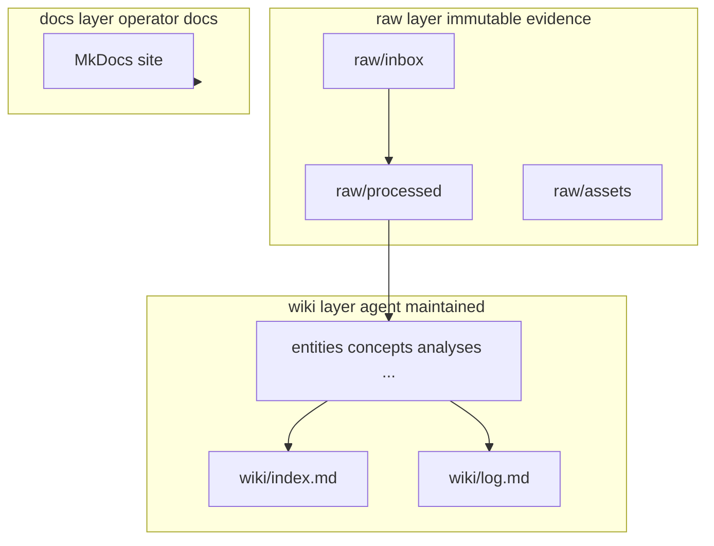

# Architecture

## Layers

| Layer | Path | Role |
|-------|------|------|
| **Raw** | `raw/` | Immutable sources after filing; provenance for claims |
| **Wiki** | `wiki/` | Structured synthesis: taxonomy, links, analyses |
| **Handbook** | `docs/` | How to run the system; built by MkDocs |
| **Examples** | `examples/` | Isolated demos; not the live corpus unless promoted |

## Contracts

- **`AGENTS.md`** — highest-priority rules for agents (ingest/query/lint, log append-only, no raw edits).
- **`wiki/index.md`** — human/agent navigation catalog.
- **`wiki/log.md`** — append-only history with parseable headings.

## Tooling

Python scripts under `scripts/` enforce deterministic checks. CI runs `uv sync --frozen`, then `validate_wiki.py --strict`, `pytest`, and `mkdocs build --strict` via `uv run`.
