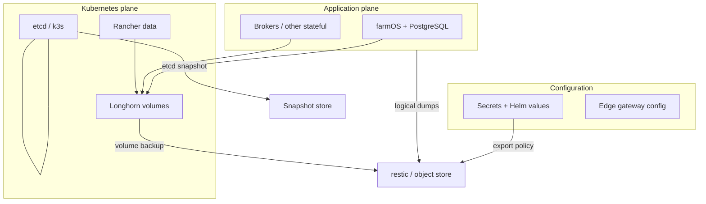

# Backup and disaster recovery package — smart farm stack

## Purpose

**Canonical navigation spine** for **backup and disaster recovery** across **farmOS**, **PostgreSQL-backed** services, **k3s** control plane (**etcd**), **Longhorn** volumes, **Rancher**, **configuration and secrets**, and **edge gateways / field devices** where they affect **whether backups complete** or **what must survive** a site loss.

**Design stance**: Prefer **restore-tested** procedures (tabletop or staging) over **decorative** backup jobs that never complete a full restore. Distinguish **backup** from **synchronization**, and **block/volume** copies from **application-consistent** recovery.

**Official pointers + captures**: [`Backup / DR — official documentation cluster`](../source-notes/backup-dr-official-documentation-cluster.md) · [`homelab backup stack captures`](../source-notes/homelab-backup-stack-official-captures-inbox-2026-04-18.md) · [`backup-dr link batch`](../../raw/processed/2026/backup-dr-official-documentation-links-batch-2026-04-17.md).

**Platform provisioning context**: [`How to provision k3s, Longhorn, and Rancher on a Raspberry Pi fleet`](how-to-provision-k3s-longhorn-and-rancher-on-a-raspberry-pi-fleet.md) · [`Homelab / edge Kubernetes platform strategy`](homelab-edge-kubernetes-platform-strategy-pi-k3s-longhorn-rancher.md).

---

## Package map

| Topic | Canonical page | What it decides |
|-------|------------------|-----------------|
| **Granularity & mechanisms** | [`Backup strategy comparison — farmOS, homelab, PostgreSQL, containers`](backup-strategy-comparison-farmos-homelab-postgresql-containers.md) | Logical DB vs volume vs restic patterns; **backup vs sync** |
| **Tiers & expectations** | [`Restore and recovery tiers — homelab farm systems`](restore-recovery-tiers-homelab-farm-systems.md) | Tier 0–3; **RPO/RTO** as **your** filled targets, not wiki-invented SLAs |
| **k3s + Longhorn + workloads** | [`Kubernetes platform backup / DR — Pi fleet, k3s, Longhorn`](kubernetes-platform-backup-dr-pi-k3s-longhorn.md) | Three tracks (app / Longhorn / etcd) |
| **Pi fleet sequence** | [`Raspberry Pi k3s fleet — backup and restore sequence`](raspberry-pi-k3s-fleet-backup-and-restore-sequence.md) | Ordered steps aligned to platform guide |
| **Central vs edge scope** | [`Central vs local backup scope — farm edge stack`](central-vs-local-backup-scope-farm-edge-stack.md) | What must land in **one** backup store vs **local** queue |
| **Validation & drills** | [`Runbook — backup validation and recovery drill`](runbook-backup-validation-and-recovery-drill.md) | Prove restores **before** an outage |
| **Off-grid scheduling** | [`Off-grid implications — backup and networking choices`](off-grid-implications-backup-and-networking-choices.md) | Power/WAN vs backup windows |

---

## Core distinctions (non-negotiable)

### Backup vs synchronization

| Backup | Synchronization |
|--------|-----------------|
| **Point-in-time** copies for **recovery** (rollback, disaster) | **Continuous** or **frequent** mirroring for **availability** or **multi-writer** convenience |
| **Immutability**-oriented retention (snapshots, restic generations) | Often **overwrites** destination—**wrong** tool for **“oops”** recovery if conflicts are resolved the wrong way |
| **Restore drills** prove value | **Sync** **drills** **prove** **replication**—**not** **the** **same** **as** **application** **rollback** |

**Rule**: Do not label a **sync** job (e.g. mirror to second disk) as your **only** “backup” without a **separate** **versioned** **recovery** **path** for **farm records**.

### Volume backup vs app-aware restore

| Volume / block backup | App-aware (logical) restore |
|----------------------|-----------------------------|
| Longhorn backup, disk snapshot, **cold** copy of data directory | **`pg_dump`** / vendor export **while** **quiesced** **or** **consistent** **per** **PostgreSQL** **rules** |
| Fast **whole-PVC** **rollback** **when** **files** **are** **consistent** | **Portable** **restore** **across** **versions** **and** **hosts** **for** **farmOS** **/** **Drupal** **+** **Postgres** |
| **Risk**: **dirty** **DB** **pages** **if** **captured** **mid-write** **without** **coordination** | **Preferred** **for** **canonical** **farm** **records** **(Tier** **2** **in** **restore** **tiers** **)** |

**Rule**: Longhorn **volume** backup **does not** **replace** **logical** **exports** **for** **farmOS** **unless** **you** **have** **proven** **crash-consistent** **recovery** **and** **accept** **that** **risk**.

---

## Scope diagram

---

## Related

- [`Telemetry system of record — boundaries and authority`](telemetry-system-of-record-boundaries-and-authority.md)
- [`Manual fallback and degraded modes — critical operations`](manual-fallback-degraded-modes-critical-operations.md)
