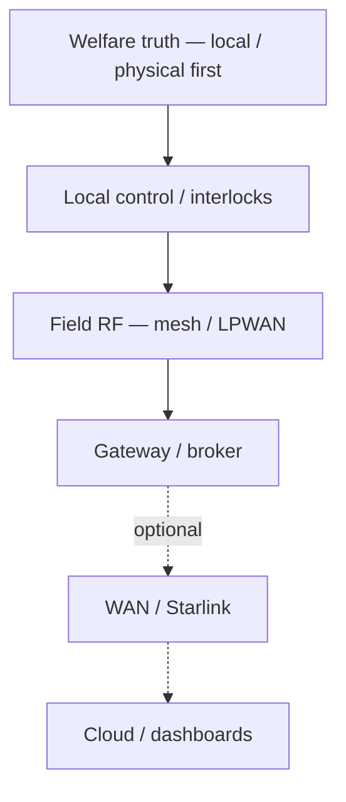

# Connectivity dependency map — farm systems (Demory farm site)

**Purpose**: **Explicit** **dependency** **map** **:** **which** **farm** **systems** **must** **operate** **with** **no** **WAN** **,** **which** **degrade** **gracefully** **,** **and** **which** **must** **never** **be** **the** **only** **proof** **of** **animal** **/** **water** **welfare** **.** **Ties** **power** **(**battery** **headroom** **)** **to** **network** **(**egress** **cost** **).**

**Doctrine package**: [`Off-grid systems doctrine package — Demory`](../topics/off-grid-systems-doctrine-package-demory-farm-site.md). **WAN policy**: [`Connectivity strategy — Claxton & Demory`](connectivity-strategy-for-claxton-and-demory.md). **SoR**: [`Telemetry system of record — boundaries and authority`](telemetry-system-of-record-boundaries-and-authority.md).

---

## Dependency table

| System / capability | **No WAN** | **No LAN** (isolated barn) | **No field RF** | Notes |
|--------------------|------------|----------------------------|-----------------|--------|
| **Water pump interlock / dry-run protection** | **Must** **work** | **Must** **work** **if** **wired** **/** **local** **logic** | **N/A** **if** **not** **RF-dependent** | **Cloud** **must** **not** **gate** **safe** **state** |
| **Tank level — operator truth** | **Local** **indicator** **/** **sight** **/** **float** **required** | Same | **Mesh** **optional** **enhancement** **only** | **G8** **/** **manual** **baseline** |
| **MQTT → cloud historian** | **Queues** **/** **drops** **(**policy** **)** | **Broker** **may** **be** **unreachable** | **Sensors** **may** **be** **dark** | **Not** **life-safety** **path** |
| **Starlink / LTE** | **Off** **is** **OK** **(**sheddable** **)** | — | — | **Wh** **budget** **item** |
| **farmOS cloud / hosted UI** | **Unavailable** | **Unavailable** | — | **Offline** **records** **discipline** |
| **Meshtastic / mesh text** | **Local** **mesh** **works** | **Partition** **possible** | **Degraded** **coverage** | **Not** **a** **substitute** **for** **rounds** |

---

## Mermaid — logical dependencies

**Rule**: **Solid** **path** **from** **welfare** **to** **local_ctrl** **must** **never** **traverse** **wan** **.**

---

## Related

- [`Local-first / WAN-optional operating model — Demory`](local-first-wan-optional-operating-model-demory-farm.md)
- [`Off-grid degraded modes — power and connectivity`](off-grid-degraded-modes-power-and-connectivity-demory-farm.md)
