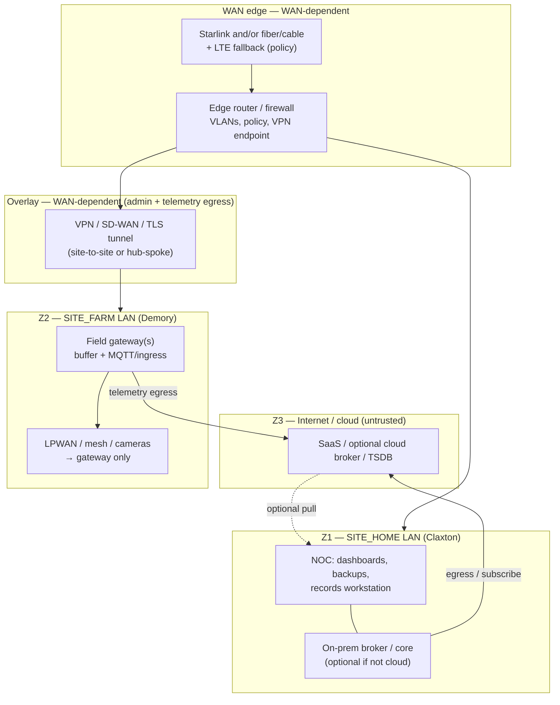
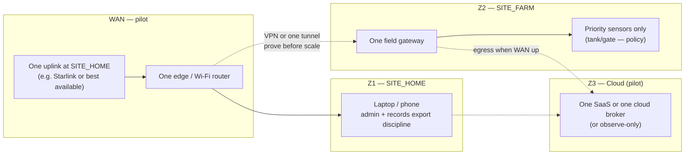
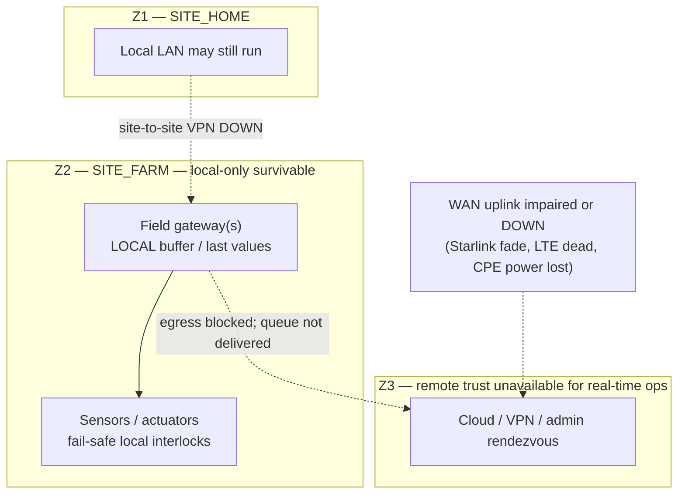

# Execution topology package — two-site smart farm (Mermaid)

## Purpose

Provide **three** **execution-oriented** Mermaid views—**reference** (intended end state), **pilot** (Phase 0/1 minimum), and **degraded** (WAN / Starlink loss)—so operators can see **trust boundaries**, **WAN dependencies**, and **local-only survivable** paths **without** treating a single decorative graph as the whole story.

**Not deployment truth**: no VLAN IDs, IPs, or radio channels—**label-level** only.

**Companion pages**

| Role | Page |
|------|------|
| **Canonical logical stack** | [`Reference architecture — 5-acre home base + 120-acre farm`](reference-architecture-5ac-homebase-120ac-smart-farm.md) |
| **WAN / Starlink / LTE posture (named sites)** | [`Connectivity strategy — Claxton home base and Demory farm site`](connectivity-strategy-for-claxton-and-demory.md) |
| **Degraded operations** | [`Manual fallback and degraded modes — critical operations`](manual-fallback-degraded-modes-critical-operations.md), [`Automation degraded modes — manual fallback SOP`](automation-degraded-modes-manual-fallback-sop.md) |
| **Runbooks** | [`Runbook — broker or backhaul down`](runbook-broker-or-backhaul-down.md), [`Runbook — power loss at remote site`](runbook-power-loss-remote-site.md) |
| **Security / remote admin** | [`Remote access and operational security model — two-site smart farm`](remote-access-operational-security-model-two-site-smart-farm.md) |
| **Deeper RF / DC / HaLow overlays** | [`Two-site smart farm — network topology and WAN/edge reference (Mermaid)`](two-site-smart-farm-network-topology-and-wan-edge-reference.md) |
| **Off-grid `SITE_FARM` (Demory)** — **power** **domains** **+** **mesh** **/** **WAN** **layers** | [`Off-grid farm execution topology — Demory (Mermaid)`](off-grid-farm-execution-topology-demory-mermaid.md) **,** [`Demory farm — site intelligence`](demory-farm-site-intelligence.md) |

**Mermaid** is enabled for the published site: [`mkdocs.yml`](../../mkdocs.yml) (`mermaid2` plugin).

---

## Legend (all diagrams)

| Marking | Meaning |
|---------|---------|
| **Z1** | **Trust zone** — `SITE_HOME` LAN (Claxton / control center)—higher **admin** trust **than** the open Internet, still **not** “safe by default.” |
| **Z2** | **Trust zone** — `SITE_FARM` LAN / field OT (Demory)—treat as **hostile Wi‑Fi** **laterally**; **limit** east-west. |
| **Z3** | **Trust zone** — **Internet** (incl. **LEO satellite path** into the edge)—**untrusted**; **encrypted** **tunnels** only for admin. |
| **Solid arrow** | **Intended** **control or data** path under **normal** ops. |
| **Dashed arrow** | **Optional**, **fallback**, or **policy-dependent** path. |
| **WAN-dependent** | Path **dies** when **all** **Internet uplinks** at that site are **down** (Starlink fade, LTE dead, fiber cut, etc.). |
| **Local-only survivable** | Path **can** **operate** **without** **WAN** **if** **local power** and **gateway** **stay** **up** (may **buffer** uploads **until** **WAN** returns). |

---

## 1. Reference topology — full intended two-site architecture

**What this shows**: **End-state** **shape**: **dual sites**, **WAN** at **home** (and **optionally** at **farm**), **encrypted** **reunion** of **logic** (**not** **flat L2** across the commute), **field RF** **behind** **gateways**.

**Interpretation**

- **Trust boundaries**: **Z3** is **never** “inside” the farm; **Z1** and **Z2** **stay** **separate** **broadcast domains**—**overlay** **reunifies** **policy**, **not** **Ethernet** across **`COMMUTE_ONE_WAY`**.
- **WAN dependencies**: **Cloud** dashboards, **remote** **admin** **to** **field**, and **egress** **from** **gateways** **require** **working** **WAN** **at** **the** **relevant** **site** (and **DNS**, **certs**, **time**—see [`Remote access and operational security model`](remote-access-operational-security-model-two-site-smart-farm.md)).
- **Local-only survivable**: **Sensors → gateway → local queue** (not drawn as a separate box—**assume** **inside** **`fgw`**) **survives** **WAN** **loss** **for** **hours** **if** **designed**; **actuator** **interlocks** **must** **not** **require** **cloud** **for** **safe** **defaults** ([`Manual fallback and degraded modes`](manual-fallback-degraded-modes-critical-operations.md)).
- **Links**: [`Reference architecture`](reference-architecture-5ac-homebase-120ac-smart-farm.md) (layered view), [`Connectivity strategy`](connectivity-strategy-for-claxton-and-demory.md) (Starlink **primary/backup/defer** per site).

---

## 2. Pilot topology — minimum viable Phase 0/1 deployment

**What this shows**: **Smallest** **useful** **slice** to **prove** **distance-tax** **relief** **and** **honest** **WAN** **behavior** **without** **funding** **full** **redundancy** **before** **fence/water** **gates** ([`Capital plan`](east-tennessee-two-site-farm-business-plan-capital-and-financing.md)).

**Interpretation**

- **Trust boundaries**: Same **Z1/Z2/Z3** **idea**—**pilot** **shrinks** **parts count**, **not** **trust**.
- **WAN dependencies**: **One** **home** **uplink** **may** **be** **enough** **for** **Phase 0/1** **if** **farm** **egress** **goes** **through** **that** **tunnel** **or** **LTE** **on** **the** **gateway**—**document** **which** **you** **actually** **built** ([`Validation and pilot plan — first 24 months`](validation-and-pilot-plan-first-24-months-east-tennessee-two-site.md)).
- **Local-only survivable**: **Gateway + priority sensors** **still** **run** **offline** **for** **short** **intervals**; **do** **not** **declare** **pilot** **“done”** **without** **a** **logged** **WAN** **outage** **drill** **and** **manual** **round** **baseline** (**G8**).
- **Links**: [`Automation stop rules`](automation-stop-rules-two-site-smart-farm.md) (observe-only defaults), [`Instrumentation priority matrix`](instrumentation-priority-matrix-two-site-smart-farm.md).

---

## 3. Degraded-mode topology — WAN outage / Starlink outage / local-only fallback

**What this shows**: **When** **LEO** **or** **any** **WAN** **fails**, **remote** **trust** **drops** **to** **zero** **for** **cloud** **and** **often** **for** **site-to-site** **admin**—**local** **paths** **remain** **for** **telemetry** **collection** **and** **safe** **defaults**.

**Interpretation**

- **Trust boundaries**: **Z3** **admin** **paths** **fail** **closed**—**do** **not** **expose** **Z2** **to** **the** **Internet** **to** **“fix”** **it** **ad** **hoc** ([`Remote access and operational security model`](remote-access-operational-security-model-two-site-smart-farm.md) **Z3a**).
- **WAN dependencies**: **Everything** **that** **required** **Z3** **in** **§1** **stops** **being** **trustworthy** **for** **real-time** **ops**—**alerts** **silence** **≠** **all-clear** **for** **livestock** **or** **water**.
- **Local-only survivable**: **Gateway ↔ sensors/actuators** **with** **battery**/**local** **power** **to** **those** **nodes**—**operator** **must** **revert** **to** **manual** **rounds** **or** **cell** **voice** **from** **the** **field** **per** [`Runbook — broker or backhaul down`](runbook-broker-or-backhaul-down.md) and **failure class A2** in [`Automation degraded modes SOP`](automation-degraded-modes-manual-fallback-sop.md). **Power** **loss** **at** **the** **remote** **site** **adds** **another** **domain**—[`Runbook — power loss at remote site`](runbook-power-loss-remote-site.md).
- **Links**: [`Manual fallback and degraded modes`](manual-fallback-degraded-modes-critical-operations.md) (**LEO satellite WAN impaired** row), [`Connectivity strategy`](connectivity-strategy-for-claxton-and-demory.md) (**must not** **silently** **depend** **on** **WAN** **for** **welfare**).

---

## Related

- [`Two-site smart farm — network topology and WAN/edge reference (Mermaid)`](two-site-smart-farm-network-topology-and-wan-edge-reference.md) — **Supplementary** diagrams (telemetry plane, DC context, HaLow vs mesh).
- [`Two-site smart farm operations`](../topics/two-site-smart-farm-operations.md) — Hub.
