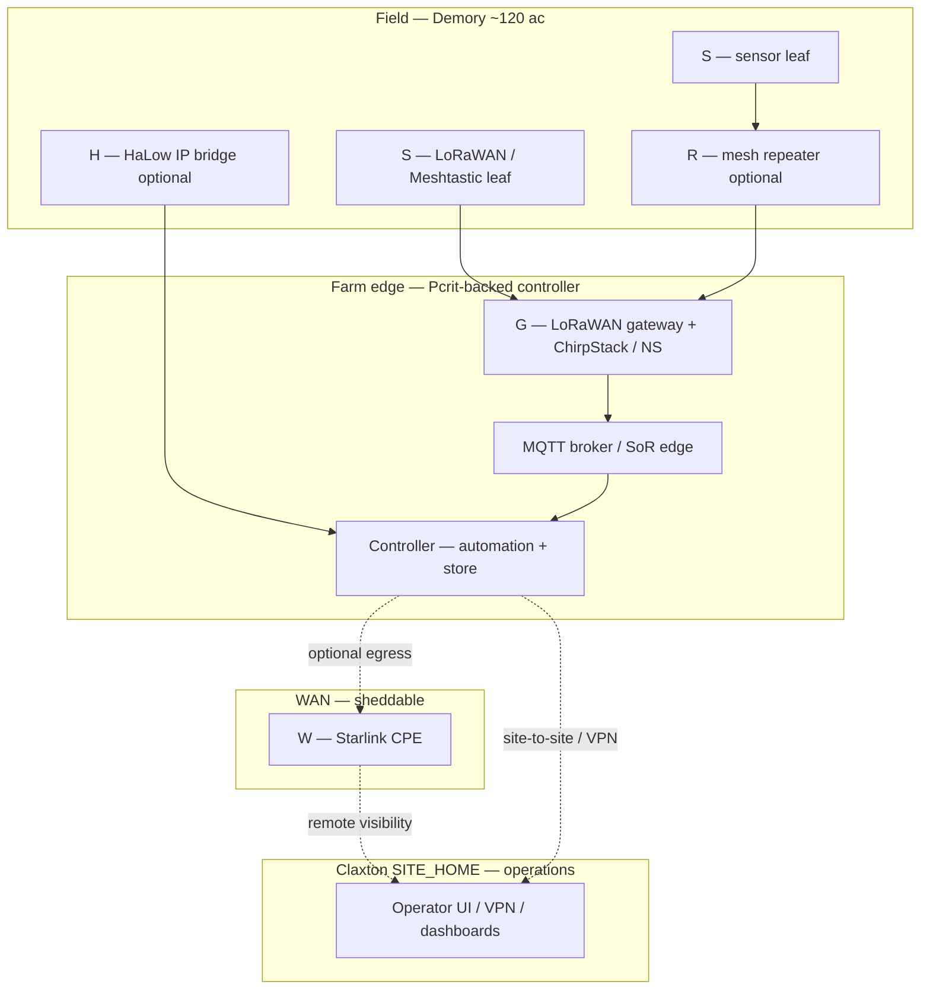
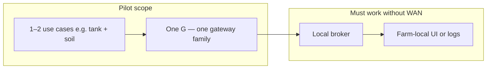
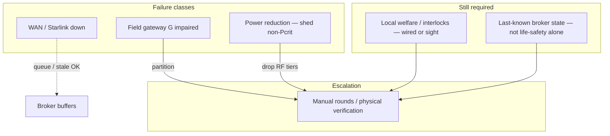

# Farm sensor architecture — Demory farm site

**Purpose**: **Canonical** reference for **long-range field sensing** on **`SITE_FARM` (Demory)** — approximately **120 acres**, **off-grid-first / resilience-first**, with **local survivability** for **basic telemetry** and **Starlink** only as **optional WAN** for **egress** and **Claxton home-site visibility**. **Does not** specify parcel coordinates, tower sites, or SKUs—those require **field survey** and **pilot evidence**.

**Assumptions** (disconfirm with mapping + RF survey): **~120 ac** production surface; **terrain** may break **LOS** for single-gateway **LoRaWAN**; **Starlink** present at a **farm edge** for **WAN** but **must not** be the only path for **local** sensor **truth** or **safety interlocks**.

**Doctrine**: [`Off-grid systems doctrine package — Demory`](../topics/off-grid-systems-doctrine-package-demory-farm-site.md) · [`Mesh and field networking strategy — off-grid Demory`](../analyses/mesh-and-field-networking-strategy-off-grid-demory-farm.md).

**Sources (official / operator cluster)**: [`Demory farm sensor layer — official and operator-grade source cluster`](../source-notes/demory-farm-sensor-layer-official-and-operator-source-cluster.md).

**Related pages**: [`Gateway and controller patterns — Demory, ~120 acres`](../analyses/gateway-controller-patterns-demory-120-acre-farm.md) · [`Sensor degraded modes and failure rules — Demory`](../analyses/sensor-degraded-modes-and-failure-rules-demory-farm.md) · [`Sensor power and duty-cycle assumptions — Demory`](../analyses/sensor-power-and-duty-cycle-assumptions-demory-farm.md) · [`Sensor checklist matrix — Demory farm`](../analyses/sensor-checklist-matrix-for-demory-farm.md) · [`LoRaWAN vs Wi‑Fi HaLow vs Meshtastic — Demory farm sensor layer`](../comparisons/lorawan-wi-fi-halow-meshtastic-demory-farm-sensor-layer.md).

---

## Layering (field vs WAN)

| Layer | Role | Starlink required? |
|-------|------|--------------------|
| **S — Sensor leaf** | Soil, tank, weather, gate state, power telemetry (**sparse** uplinks) | **No** |
| **R — Mesh repeater** (Meshtastic-class) | Multi-hop where **no** single gateway sees all edges | **No** |
| **G — Field gateway** | LoRaWAN **NS** / **ChirpStack**, **MQTT** to **local broker**, **buffer** | **No** for **local** delivery |
| **H — HaLow / 802.11ah IP bridge** | **IP-native** sensors / bridges where **LoRa** throughput is insufficient | **No** for **LAN segment** |
| **Controller / edge** | **Broker**, **SoR edge**, optional **k3s** workloads (**Pcrit** tier) | **No** |
| **W — WAN edge** | **Starlink** CPE → **internet** | **Yes** **only** for **cloud** / **remote** **Claxton** **visibility** |

**Rule**: **Basic sensing** and **welfare-critical** **local** **logic** **must** **not** **depend** on **Starlink**—see [`Connectivity dependency map — Demory`](../analyses/connectivity-dependency-map-farm-systems-demory-farm.md).

---

## Starlink as WAN/backhaul (sensor architecture)

Starlink terminates **WAN** at the **farm controller site**—**not** in the **field RF** layer. Field devices speak **LoRaWAN / mesh / HaLow** to **G**/**H**; **G** connects **east** to **MQTT/DB** and **north** to **WAN** for **remote operators** at **Claxton**.

- **Policy detail**: [`Connectivity strategy — Claxton & Demory`](../analyses/connectivity-strategy-for-claxton-and-demory.md).
- **Entity**: [`WAN edge and backhaul roles`](../entities/wan-edge-and-backhaul-roles.md).

When **WAN is down**, **local** **broker** **state** and **queues** define what **Claxton** **cannot** **see** until **reconnect**—design **SoR** and **alerting** accordingly ([`Telemetry system of record — boundaries and authority`](telemetry-system-of-record-boundaries-and-authority.md)).

---

## Reference architecture (steady-state)

**Legend**: **Solid** = local-first path; **Dashed** = optional WAN.

**Local-only survivable** (no Starlink): **S → G → BR → CTRL** and **on-CTRL** **dashboards** at **farm**.

---

## Pilot architecture (Phase 0–1)

Reduce **RF families** and **gateways** until **DR-5**-class evidence exists ([`Off-grid infrastructure stop rules`](off-grid-operational-decision-rules-power-and-networking-demory-farm.md)).

---

## Degraded-mode architecture (WAN loss / gateway loss / power reduction)

**Runbooks**: [`Runbook — broker or backhaul down`](../analyses/runbook-broker-or-backhaul-down.md) · [`Runbook — sensor false-positive alert triage`](../analyses/runbook-sensor-false-positive-alert-triage.md) · [`Off-grid degraded modes — power and connectivity (Demory)`](../analyses/off-grid-degraded-modes-power-and-connectivity-demory-farm.md).

---

## Cross-site visibility (Claxton)

**Goal**: **Telemetry** and **operational** **visibility** at **Claxton** **without** **making** **Starlink** a **hidden** **dependency** for **field** **truth**.

- **Preferred**: **SoR** or **broker** **replication** / **sync** with **explicit** **staleness** **labels** when **WAN** **flaps**.
- **Avoid**: **Only** **cloud** **dashboard** **as** **authority** **for** **field** **state**.

**Two-site ops hub**: [`Two-site smart farm operations`](../topics/two-site-smart-farm-operations.md).

---

## Related

- [`Field-node classes and communication roles — Demory`](field-node-classes-and-communication-roles-demory-farm.md)
- [`Field telemetry reference architecture — homestead + 120-acre farm`](field-telemetry-reference-architecture-homestead-120ac.md)
- [`Reference architecture — 5 ac + 120 ac`](../analyses/reference-architecture-5ac-homebase-120ac-smart-farm.md)
- [`Wi‑Fi HaLow vs LoRaWAN vs Meshtastic vs conventional Wi‑Fi`](../comparisons/wi-fi-halow-lorawan-meshtastic-conventional-wi-fi-farm-field-networking.md)
