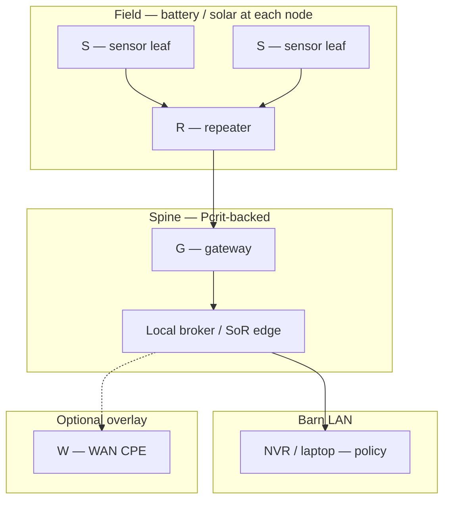

# Field-node classes and communication roles — Demory farm site

**Purpose**: **Architecture-level** **classes** **for** **field** **nodes** **(**roles** **,** **not** **product** **SKUs** **)** **:** **what** **each** **class** **does** **in** **the** **local-first** **network** **,** **typical** **power** **posture** **,** **and** **WAN** **dependence** **.** **Pair** **with** [`Mesh and field networking — off-grid Demory`](mesh-and-field-networking-strategy-off-grid-demory-farm.md) **and** [`Meshtastic vs HaLow vs Wi‑Fi`](../comparisons/meshtastic-wi-fi-halow-conventional-wi-fi-off-grid-farm-operations.md) **.**

**Doctrine package**: [`Off-grid systems doctrine package — Demory`](../topics/off-grid-systems-doctrine-package-demory-farm-site.md).

---

## Node classes (roles)

| Class | Communication role | Typical power | WAN required? |
|-------|-------------------|---------------|---------------|
| **G — Gateway / spine** | Aggregates mesh/LPAN → MQTT or local broker; **buffer** when cloud absent | **Battery-backed** **from** **Pcrit** **/** **T1** **tier** | **No** **for** **local** **delivery** |
| **R — Mesh repeater** | Extends range; **may** **not** **see** **all** **sensors** **alone** | **Solar** **+** **small** **local** **pack** **;** **often** **duty-cycled** | **No** |
| **S — Sensor leaf** | **Sparse** **telemetry** **;** **LoRa** **/** **mesh** **leaf** | **mW–W** **class** **;** **event** **or** **slow** **cadence** | **No** |
| **H — Sub-GHz IP bridge** | **HaLow** **/** **802.11ah** **segment** **for** **IP** **devices** **where** **LoRa** **is** **too** **slow** | **Higher** **than** **S** **;** **budget** **airtime** **+** **sleep** | **No** **for** **LAN** **segment** |
| **W — WAN edge** | Starlink / LTE CPE; **egress** | **Sheddable** **(**not** **Pcrit** **default** **)** | **Yes** **for** **cloud** **path** **only** |

---

## Role diagram

---

## Pilot discipline (Phase 0–1)

- **One** **G** **+** **one** **RF** **family** **(**mesh** **OR** **LoRaWAN** **OR** **HaLow** **segment** **)** **until** **DR-5** **evidence** **(**[`Off-grid infrastructure stop rules`](off-grid-operational-decision-rules-power-and-networking-demory-farm.md)**)** **.**
- **No** **second** **WAN** **terminal** **until** **DR-2** **passes** **.**

---

## Related

- [`Power domains and battery-backed infrastructure tiers — Demory`](off-grid-power-domains-and-battery-tiers-demory-farm.md)
- [`Connectivity dependency map — farm systems (Demory)`](connectivity-dependency-map-farm-systems-demory-farm.md)
