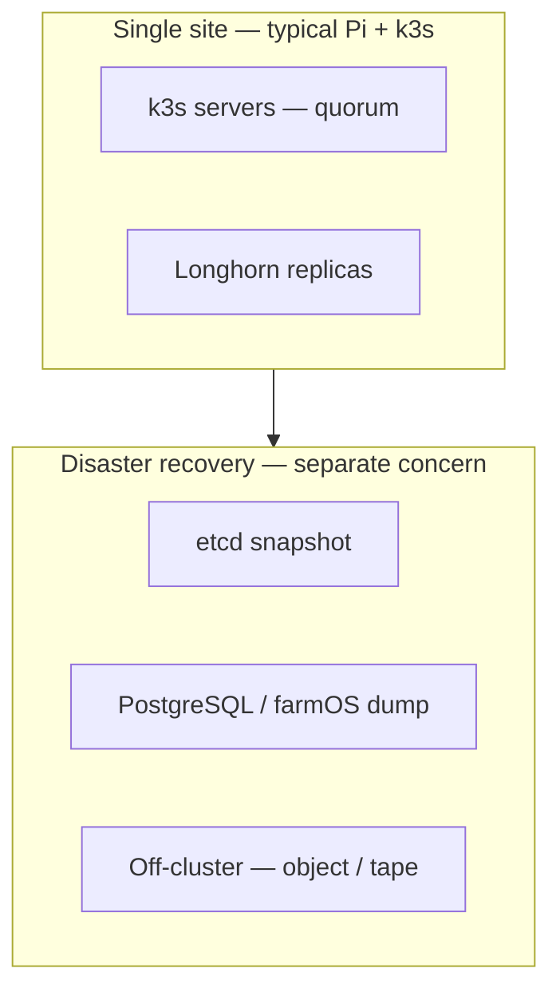

# HA meaning and constraints — homelab / farm platform

**Purpose**: **Disambiguate** “high availability” for **this** repository—**Pi edge**, **single-site** or **two-site** **operations**, **family-scale** ops—so decisions are not driven by **vendor** **HA** **slides** alone. **Official** HA patterns for k3s: [High Availability Embedded etcd](https://docs.k3s.io/datastore/ha-embedded) and related datastore docs.

**Package**: [`Platform doctrine package — homelab / farm edge`](../topics/platform-doctrine-package-homelab-farm-edge.md). **Governance**: [`Platform decision memo`](platform-decision-memo-phase-homelab-k3s-pi-fleet-2026-04-18.md).

---

## Terms (this wiki)

| Term | Meaning here | Not implied |
|------|--------------|-------------|
| **k3s HA control plane** | **Multiple** server nodes with **quorum** datastore per k3s **HA** docs; **tested** failover and **restore** | Zero **RPO** for **application** data; **no** ops work |
| **Longhorn replication** | **Survive** loss of a **node** or **disk** on the **same** **LAN** cluster | Geographic redundancy; **immutable** backup |
| **Central NAS “HA”** | Appliance or **dual-path** **vendor** **features** **if** **you** **bought** **them** | Kubernetes **SLO** unless mounted as **PV** **with** **clear** **failure** **semantics** |
| **Application HA** | **farmOS** / **DB** **available** during **your** **maintenance** **window** | **Five nines**; **multi-region** **active-active** |

---

## Constraint diagram

**Reading**: **Cluster** HA and **DR** are **adjacent** but **not** the same investment; this wiki **requires** **app-level** backup **regardless** of **etcd** HA.

---

## When to add k3s HA (heuristic)

| Signal | Interpretation |
|--------|----------------|
| **Planned** maintenance **windows** **weekly** and **family** **OK** with **brief** **API** **outage** | **Single** server may **remain** **appropriate** |
| **Cannot** tolerate **control-plane** **outage** **during** **season** **(planting, calving)** | **Design** **HA** **and** **run** **failover** **drill** **before** **the** **season** |
| **Only** **one** **Pi** **worth** **of** **budget** | **Do** **not** **simulate** **HA** **with** **unstable** **hardware**—**stability** **first** |

---

## Farm / two-site angle

- **Control plane at `SITE_HOME`**, **agents** or **future** **cluster** **at** **`SITE_FARM`**: **WAN** **and** **power** **are** **the** **real** **SLO** **constraints**—see [`Two-site smart farm operations`](../topics/two-site-smart-farm-operations.md) and [`off-grid power — Demory`](../analyses/off-grid-power-strategy-demory-farm-site.md).
- **“HA”** **across** **two** **properties** **is** **not** **solved** **by** **Longhorn** **alone**—**need** **RTO/RPO** **targets** **and** **backup** **routing** ([`Central vs distributed storage`](longhorn-vs-central-storage-architecture-homelab-farm-platform.md)).

---

## Related

- [`k3s role in the homelab / farm platform`](k3s-role-in-homelab-farm-platform.md)
- [`Longhorn role in the homelab / farm platform`](longhorn-role-in-homelab-farm-platform.md)
- [`Kubernetes platform backup / DR`](kubernetes-platform-backup-dr-pi-k3s-longhorn.md)
