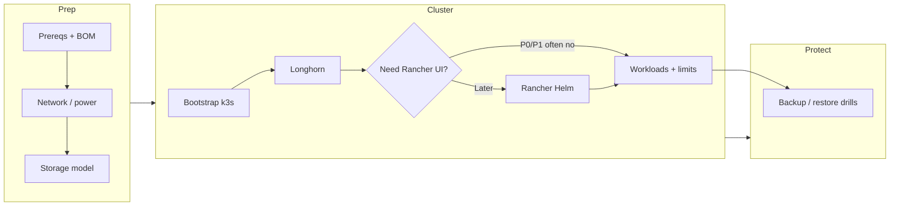

# How to provision k3s, Longhorn, and Rancher on a Raspberry Pi fleet

## Purpose

Canonical operator runbook for standing up a small Raspberry Pi (or Pi-class ARM) fleet running k3s, Longhorn, and optionally Rancher, with either distributed Longhorn disks or central / multi-server storage—without assuming unbounded CPU, RAM, or disk IOPS on the nodes.

**Doctrine package** (what the platform is for, HA meaning, approved vs deferred): [`Platform doctrine package — homelab / farm edge`](../topics/platform-doctrine-package-homelab-farm-edge.md). **Strategy and tradeoffs** (why, not only how): [`Platform strategy for farm and homestead services`](homelab-edge-kubernetes-platform-strategy-pi-k3s-longhorn-rancher.md), [`Platform decision memo — phase, HA scope, deferrals`](platform-decision-memo-phase-homelab-k3s-pi-fleet-2026-04-18.md). **Per-node checklist**: [`Raspberry Pi fleet provisioning standard`](raspberry-pi-fleet-provisioning-standard-smart-farm-homelab.md). **Captures**: [`K3s / Longhorn / Rancher / Pi platform source note`](../source-notes/k3s-longhorn-rancher-pi-platform-official-captures-inbox-2026-04-18.md).

---

## Legend (used across this package)

| Tag | Meaning |
|-----|---------|
| **Mandatory** | Required for a **minimal** working cluster on Pi-class hardware. |
| **Optional (HA / scale)** | Improves **availability** or **capacity**; adds **complexity**, **power**, and **ops** **burden**—do not mix into Phase 0/1 without intent. |
| **P0** | **Lab / learning**—throwaway data OK; fastest path. |
| **P1** | **Pilot** on real workloads (e.g. farmOS trial)—**backups** and **resource limits** **expected**. |
| **Later** | **Production-style** HA, multi-site, or heavy **Rancher** coupling—after k3s + storage are **boring**. |

---

## Package map (read in order)

| Step | Page | What you do there |
|------|------|-------------------|
| 0 | [`Prerequisites and assumptions`](raspberry-pi-k3s-fleet-prerequisites-and-assumptions.md) | Confirm **OS**, **RAM/disk** reality, **scope** (P0 vs P1 vs Later). |
| 1 | [`Hardware BOM and node roles`](raspberry-pi-k3s-fleet-hardware-bom-and-node-roles.md) | Assign **server / agent / storage** roles; size **SSD** vs **SD**. |
| 2 | [`Network and power prerequisites`](raspberry-pi-k3s-fleet-network-and-power-prerequisites.md) | Stable **LAN**, **DNS**, **time**, **UPS** / brownout behavior. |
| 3 | [`Central and HA storage options`](raspberry-pi-k3s-fleet-central-and-ha-storage-options.md) | Pick **Longhorn-only**, **central NAS**, or **hybrid**; optional **HA** etcd path. |
| 4 | [`Bootstrap sequence`](raspberry-pi-k3s-fleet-bootstrap-sequence.md) | Install **k3s** server → **agents** → **kubeconfig** hygiene. |
| 5 | [`Longhorn storage configuration sequence`](raspberry-pi-k3s-fleet-longhorn-storage-configuration-sequence.md) | **open-iscsi**, Longhorn install, **StorageClass**, **replica** policy on Pi. |
| 6 | [`Rancher installation sequence`](raspberry-pi-k3s-fleet-rancher-installation-sequence.md) | **Defer** for P0; Helm install when **ingress + certs** ready (**Later** default for farm edge). |
| 7 | [`Backup and restore sequence`](raspberry-pi-k3s-fleet-backup-and-restore-sequence.md) | **App dumps** + **Longhorn** + **etcd** awareness—see also [`Kubernetes platform backup / DR`](kubernetes-platform-backup-dr-pi-k3s-longhorn.md). |
| 8 | [`Validation checklist`](raspberry-pi-k3s-fleet-validation-checklist.md) | **kubectl**, Longhorn UI, workload smoke tests. |
| 9 | [`Troubleshooting and degraded modes`](raspberry-pi-k3s-fleet-troubleshooting-and-degraded-modes.md) | **OOM**, **disk pressure**, **split-brain**, **WAN-down** **farm** **edge**. |

---

## End-to-end flow (reference)

---

## Resource rule (all phases)

Treat each Pi as a small, battery- and thermally constrained node: cap Longhorn replicas, limit cluster add-ons, prefer logical DB backups over churning snapshots, and measure idle watts and peak CPU before declaring production. For farm-site power context see [`Off-grid power strategy — Demory`](off-grid-power-strategy-demory-farm-site.md).

---

## Related (outside this package)

- [`Backup and disaster recovery package — smart farm stack`](backup-and-disaster-recovery-package-smart-farm-stack.md) — farmOS, PostgreSQL, k3s/etcd, Longhorn, Rancher, secrets, edge scope; **restore-tested** emphasis
- [`Longhorn vs central storage architecture`](longhorn-vs-central-storage-architecture-homelab-farm-platform.md)
- [`Rancher — role and timing`](rancher-role-and-timing-k3s-homelab-farm-platform.md)
- [`Backup strategy comparison — farmOS, homelab, PostgreSQL, containers`](backup-strategy-comparison-farmos-homelab-postgresql-containers.md)
