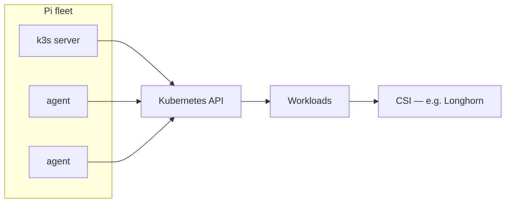

# k3s role in the homelab / farm platform

**Purpose**: Define what **k3s** **is responsible for** in this wiki’s platform doctrine—**certified Kubernetes** on small fleets—versus what belongs in **compose**, **bare metal**, or **vendor appliances**. **Official baseline**: [K3s documentation](https://docs.k3s.io/) (architecture, installation, HA datastore).

**Package**: [`Platform doctrine package — homelab / farm edge`](../topics/platform-doctrine-package-homelab-farm-edge.md). **Strategy**: [`Platform strategy for farm and homestead services`](homelab-edge-kubernetes-platform-strategy-pi-k3s-longhorn-rancher.md).

---

## What k3s provides

| Responsibility | Notes |
|----------------|--------|
| **Kubernetes API** | Deploy **Deployments**, **StatefulSets**, **Services**, **Ingress**—same **object model** as larger clusters, lower operational surface than full kubeadm in many homelab setups. |
| **Node lifecycle** | **Server** nodes (control plane + datastore) vs **agent** nodes (workers)—see [quick-start](https://docs.k3s.io/quick-start) and [`bootstrap sequence`](raspberry-pi-k3s-fleet-bootstrap-sequence.md). |
| **Embedded datastore option** | Single-server **SQLite** / embedded etcd patterns vs **HA** multi-server—**not** interchangeable without migration planning ([`HA meaning and constraints`](ha-meaning-and-constraints-homelab-farm-platform.md)). |
| **Extension points** | **Helm**, **CSI** (e.g. Longhorn), **CNI**—enables **stateful** farm apps **without** inventing a bespoke orchestrator. |

---

## Control-plane assumptions (this repo)

1. **Phase 0/1** defaults to **one** k3s **server** and **N** **agents** unless you have written **uptime** and **failover** requirements ([`platform decision memo`](platform-decision-memo-phase-homelab-k3s-pi-fleet-2026-04-18.md)).
2. **etcd / datastore backups** are **cluster infrastructure** backups—**not** a substitute for **PostgreSQL** logical dumps for farmOS ([`Kubernetes platform backup / DR`](kubernetes-platform-backup-dr-pi-k3s-longhorn.md)).
3. **Pi-class hardware**: CPU/RAM/IOPS budgets are **tight**; **not every** container deserves a cluster—see **operational boundaries** below.

---

## Operational boundaries

| In scope for k3s here | Prefer simpler path first |
|------------------------|----------------------------|
| **farmOS** + DB, **MQTT** stack, **observability** that benefits from **uniform** deploy/rollout | **Single** static service on **one** Pi → **Docker Compose** or **k3s with one manifest**—avoid **microservice** sprawl ([`farmOS Docker capture`](../../raw/processed/2026/farmos-docker-developing-hosting-capture-inbox-2026-04-17.md) as **lighter** dev pattern). |
| **StatefulSets** with **PVCs** + backup discipline | “**Kubernetes** because resume keyword” without workloads |
| **Same** cluster at **homestead** controlling **replication** to **edge** | **Multi-site** **HA** **Kubernetes** without **WAN** **and** **power** **truth** |

---

## Diagram — k3s in the stack

---

## Related

- [`Raspberry Pi fleet provisioning standard`](raspberry-pi-fleet-provisioning-standard-smart-farm-homelab.md)
- [`Longhorn role in the homelab / farm platform`](longhorn-role-in-homelab-farm-platform.md)
- [`How to provision k3s, Longhorn, and Rancher on a Raspberry Pi fleet`](how-to-provision-k3s-longhorn-and-rancher-on-a-raspberry-pi-fleet.md)
