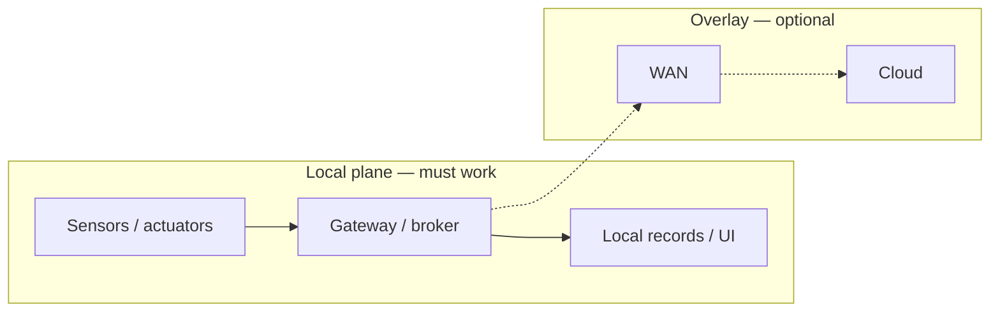

# Local-first / WAN-optional operating model — Demory farm site

**Purpose**: **Operating** **model** **for** **`SITE_FARM`** **:** **local** **sensor** **→** **gateway** **→** **actuator** **/** **records** **paths** **work** **without** **internet** **;** **WAN** **adds** **convenience** **,** **egress** **,** **and** **remote** **admin** **when** **power** **and** **policy** **allow** **.** **Aligns** **with** [`Connectivity strategy — Claxton & Demory`](connectivity-strategy-for-claxton-and-demory.md) **(**farm** **WAN** **conditional** **).**

**Doctrine package**: [`Off-grid systems doctrine package — Demory`](../topics/off-grid-systems-doctrine-package-demory-farm-site.md). **Mesh layers**: [`Mesh and field networking — off-grid Demory`](mesh-and-field-networking-strategy-off-grid-demory-farm.md).

---

## Principles

| Principle | Implication |
|-----------|-------------|
| **Local-first** | **MQTT** **broker** **,** **gateway** **,** **and** **critical** **interlocks** **are** **LAN** **/** **field** **scope** **first** |
| **WAN-optional** | **Starlink** **/** **LTE** **is** **not** **assumed** **for** **daily** **ops** **;** **budget** **Wh** **and** **ops** **time** |
| **Power-network coupling** | **Turning** **on** **WAN** **without** **SOC** **headroom** **is** **a** **power** **failure** **mode** |

---

## Always-on vs duty-cycled (operations view)

| Always-on (policy default) | Duty-cycled or event-driven |
|----------------------------|-----------------------------|
| **Gateway** **spine** **(**one** **)** **if** **it** **carries** **Tier-1** **telemetry** | **Mesh** **repeaters** **(**sleep** **/** **solar** **)** |
| **Minimal** **broker** **for** **local** **automation** **(**resource-bounded** **)** | **Starlink** **CPE** **(**schedule** **/** **SOC** **gates** **)** |
| **Pump** **control** **logic** **(**as** **designed** **)** | **Cameras** **,** **non-critical** **Wi‑Fi** **,** **extra** **HaLow** **APs** |

---

## Pilot (Phase 0–1) vs later

| Phase | Operating bar |
|-------|----------------|
| **0–1** | **One** **gateway** **,** **one** **RF** **class** **,** **one** **optional** **WAN** **path** **(**[`DR-5`](off-grid-operational-decision-rules-power-and-networking-demory-farm.md)**)** **;** **manual** **rounds** **remain** **authoritative** |
| **Scale** | **Additional** **hops** **only** **with** **metered** **`P_NET`** **and** **O&M** **budget** **(**[`DR-1`](off-grid-operational-decision-rules-power-and-networking-demory-farm.md)**)** |

---

## Mermaid — operating planes

---

## Related

- [`Connectivity dependency map — farm systems (Demory)`](connectivity-dependency-map-farm-systems-demory-farm.md)
- [`Execution first 90 days — Phase 0–1`](execution-first-90-days-phase-0-1-east-tennessee.md) (**Demory** **parallel** **rules**)
