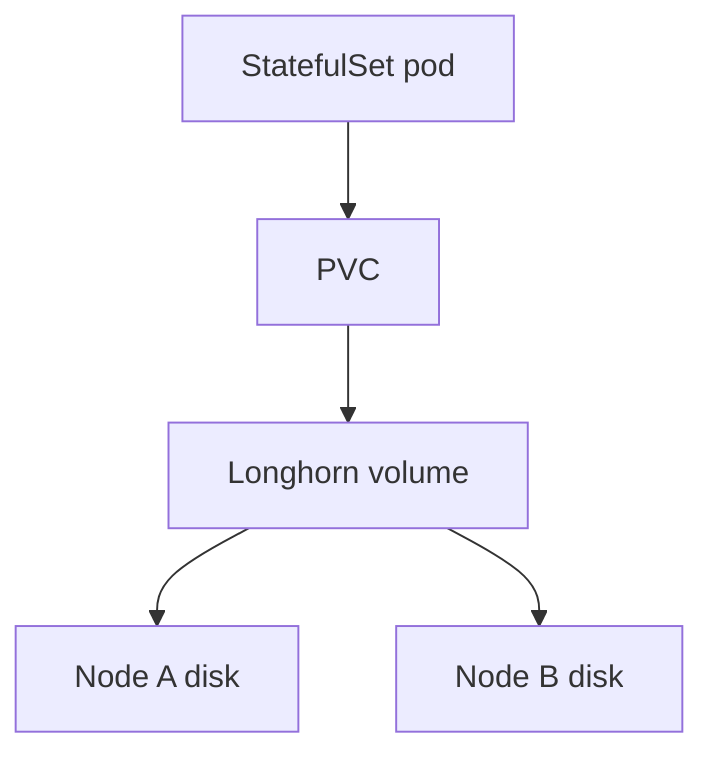

# Longhorn role in the homelab / farm platform

**Purpose**: Define what **Longhorn** **adds** to **k3s** in this doctrine—**distributed block storage** for **PVCs**—and what it **does not** replace (backups, geographic DR, bulk file semantics). **Official baseline**: [Longhorn documentation](https://longhorn.io/docs/), especially [installation on K3s](https://longhorn.io/docs/latest/deploy/install/install-with-kubectl/) and prerequisites (**iSCSI**, disks).

**Package**: [`Platform doctrine package — homelab / farm edge`](../topics/platform-doctrine-package-homelab-farm-edge.md). **Comparison (when not Longhorn)**: [`Central vs distributed storage architecture`](longhorn-vs-central-storage-architecture-homelab-farm-platform.md).

---

## What Longhorn is responsible for

| Responsibility | Notes |
|----------------|--------|
| **Dynamic PVs / PVCs** | CSI-provisioned volumes for **StatefulSets** (e.g. database data directories, broker persistence). |
| **Replication within the cluster** | **Replica** count across **nodes**—**LAN** scope; **not** multi-building **without** network design. |
| **Snapshots / backups** (Longhorn features) | **Volume**-level tooling; **still** pair with **application-consistent** backup for databases ([`Backup strategy comparison`](../analyses/backup-strategy-comparison-farmos-homelab-postgresql-containers.md)). |

---

## Operational cost (honest)

- **iSCSI** client packages on **every** node ([`Longhorn CSI on K3s`](../../raw/processed/2026/longhorn-csi-on-k3s-docs-capture-inbox-2026-04-18.md)).
- **CPU/RAM** for engine + replica management—on **Pi**, keep **few** large PVCs vs many tiny ones.
- **Disk**: **SD-only** nodes are a **poor** fit for Longhorn backing stores; prefer **USB3 SSD** or better per operator narratives in [`Pi + k3s + Longhorn capture`](../../raw/processed/2026/raspberry-pi-k3s-longhorn-rancher-homelab-capture-inbox-2026-04-18.md).

---

## What Longhorn does not guarantee

| Expectation | Reality |
|-------------|---------|
| **“HA database”** without app backup | **PostgreSQL** still needs **logical** dumps / PITR policy for farm records. |
| **Geo-redundancy** | Longhorn is **not** cross-region object storage. |
| **Ransomware-proof** immutability | Use **object-lock**, **air-gap**, or **offline** copies—see [`DR package`](../analyses/backup-and-disaster-recovery-package-smart-farm-stack.md). |

---

## Diagram — Longhorn relative to workloads

---

## Related

- [`k3s role in the homelab / farm platform`](k3s-role-in-homelab-farm-platform.md)
- [`Raspberry Pi k3s fleet — Longhorn storage configuration sequence`](raspberry-pi-k3s-fleet-longhorn-storage-configuration-sequence.md)
- [`Kubernetes platform backup / DR`](kubernetes-platform-backup-dr-pi-k3s-longhorn.md)
