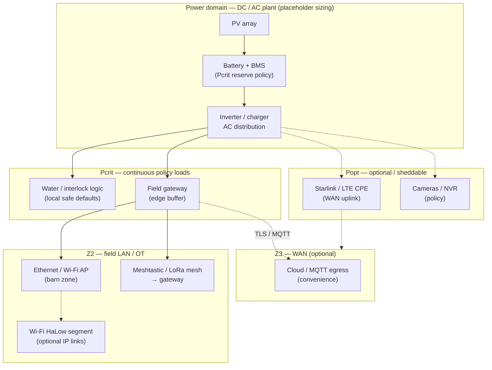
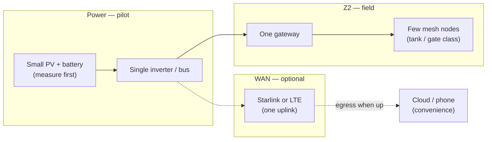
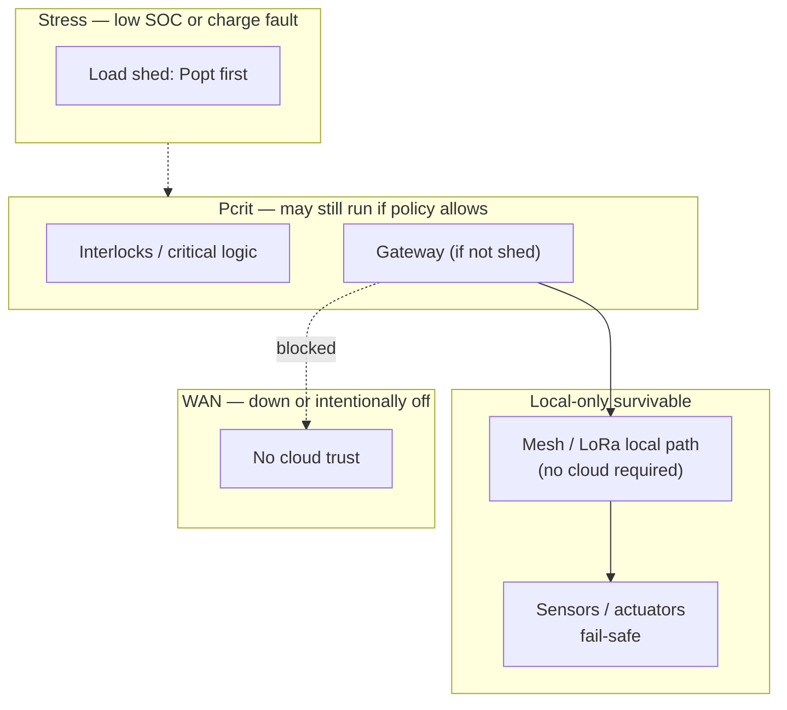

# Off-grid farm execution topology — Demory (Mermaid)

## Purpose

**Three** **Mermaid** **views** **for** **`SITE_FARM`** **(Demory)** **:** **reference** **(intended** **off-grid** **+** **field** **network** **) **,** **pilot** **(Phase** **0/1** **) **,** **degraded** **(low** **SOC** **/** **WAN** **loss** **/** **local-only** **)** **—** **with** **power** **domains** **and** **trust** **zones** **.**

**Doctrine** **package** **:** [`Off-grid systems doctrine package — Demory`](../topics/off-grid-systems-doctrine-package-demory-farm-site.md) **.**

**Policy** **pages** **:** [`Off-grid power doctrine — Demory farm site`](off-grid-power-strategy-demory-farm-site.md) **,** [`Mesh and field networking strategy — off-grid Demory farm`](mesh-and-field-networking-strategy-off-grid-demory-farm.md) **,** [`Off-grid degraded modes — power and connectivity`](off-grid-degraded-modes-power-and-connectivity-demory-farm.md) **.**

**Two-site** **WAN** **context** **(**Claxton** **vs** **Demory** **)** **:** [`Execution topology package — two-site smart farm (Mermaid)`](execution-topology-package-two-site-smart-farm.md) **.**

**Mermaid** **:** [`mkdocs.yml`](../../mkdocs.yml) **(**`mermaid2` **plugin** **).**

---

## Legend

| Mark | Meaning |
|------|---------|
| **Pcrit** | **Battery-backed** **“** **keep** **alive** **”** **loads** **(**policy** **—** **placeholder** **list** **)** **.** |
| **Popt** | **Sheddable** **optional** **loads** **(**cameras** **dense** **,** **Starlink** **CPE** **,** **extra** **RF** **)** **.** |
| **Z2** | **Field** **OT** **/** **LAN** **—** **hostile** **lateral** **assumption** **(**[`Remote access`](../analyses/remote-access-operational-security-model-two-site-smart-farm.md)**)** **.** |
| **Z3** | **WAN** **/** **Internet** **—** **untrusted** **.** |
| **Solid** | **Intended** **normal** **path** **.** |
| **Dashed** | **Optional** **/** **sheddable** **.** |

---

## 1. Reference topology — off-grid Demory farm (intended)

**Interpretation**: **Networking** **loads** **sit** **inside** **the** **same** **energy** **budget** **as** **pumps** **—** **Starlink** **and** **dense** **video** **are** **Popt** **unless** **you** **promote** **them** **in** **writing** **.** **Mesh** **/** **HaLow** **stay** **below** **WAN** **for** **local** **survivability** **.**

---

## 2. Pilot topology — Phase 0/1 minimum viable

**Interpretation**: **Prove** **Wh/day** **before** **adding** **HaLow** **infrastructure** **or** **a** **second** **WAN** **path** **(**[`Decision rules`](off-grid-operational-decision-rules-power-and-networking-demory-farm.md)**)** **.**

---

## 3. Degraded topology — low SOC and/or WAN loss

**Interpretation**: **When** **SOC** **is** **deep** **,** **shed** **Popt** **before** **you** **lose** **pump** **logic** **.** **When** **WAN** **is** **gone** **,** **mesh** **may** **still** **carry** **local** **telemetry** **to** **a** **live** **gateway** **;** **if** **gateway** **is** **shed** **,** **revert** **to** **manual** **rounds** **(**[`Off-grid degraded modes`](off-grid-degraded-modes-power-and-connectivity-demory-farm.md)**)** **.**

---

## Related

- [`Demory farm — site intelligence`](demory-farm-site-intelligence.md)
- [`Two-site smart farm — network topology and WAN/edge reference (Mermaid)`](two-site-smart-farm-network-topology-and-wan-edge-reference.md)
