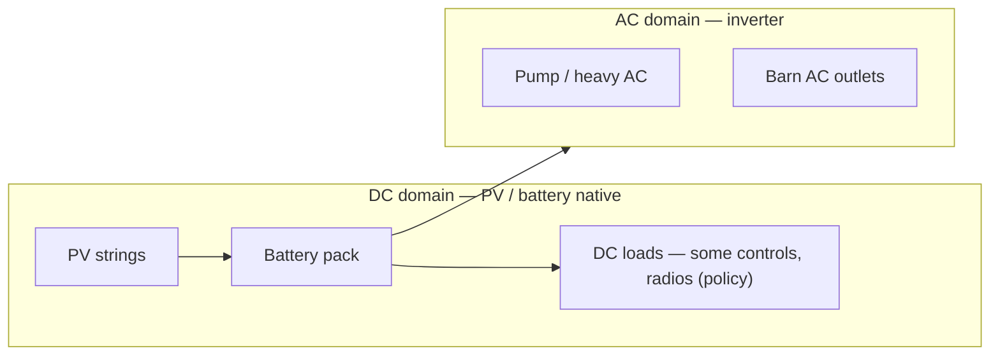

# Power domains and battery-backed infrastructure tiers — Demory farm site

**Purpose**: Tie **electrical** **domains** to **which** **infrastructure** **must** **remain** **battery-backed** **and** **which** **can** **be** **duty-cycled** **—** **so** **network** **design** **( gateways** **,** **radios** **)** **lands** **on** **the** **same** **buses** **as** **pumps** **and** **controls** **.** **No** **invented** **wattages** **;** **use** **placeholders** **until** **metered** **.**

**Doctrine package**: [`Off-grid systems doctrine package — Demory`](../topics/off-grid-systems-doctrine-package-demory-farm-site.md). **Power doctrine**: [`Off-grid power doctrine — Demory farm site`](off-grid-power-strategy-demory-farm-site.md). **Topology**: [`Off-grid farm execution topology — Demory (Mermaid)`](off-grid-farm-execution-topology-demory-mermaid.md).

---

## Naming (aligned with validation text)

| Symbol | Meaning |
|--------|---------|
| **Pcrit** | **Loads** **and** **controls** **that** **must** **stay** **up** **through** **normal** **cloud** **/** **WAN** **outages** **and** **short** **SOC** **dips** **(**policy** **+** **engineering** **)** |
| **Popt** | **Optimistic** **/** **sheddable** **loads** **:** **extra** **RF** **,** **non-critical** **cameras** **,** **optional** **CPE** **,** **shop** **toys** |

**Placeholder** **:** **`P_NET_ALWAYS_W`** **=** **___** **W** **(**clamp** **meter** **)** **;** tie to [`Loads register`](loads-register-known-estimated-unknown-two-sites-east-tennessee.md).

---

## Domains (conceptual)

**Decision**: **Minimize** **inverter** **hours** **for** **pure** **DC** **where** **safe** **and** **code-compliant** **—** **cite** **AHJ** **/** **NEC** **with** **a** **PE** **for** **final** **design** **.**

---

## Battery-backed tiers

| Tier | What belongs | Network tie-in | Always-on vs duty-cycled |
|------|--------------|----------------|---------------------------|
| **T0 — Life/safety policy** | Interlocks that **must not** depend on cloud | **Local** **logic** **/** **wiring** **first** **;** **IP** **optional** | **Always-on** **power** **path** **(**small** **Wh** **if** **done** **right** **)** |
| **T1 — Gateway spine** | **One** **field** **gateway** **/** **MQTT** **aggregation** | **Backs** **mesh** **→** **LAN** **;** **buffers** **when** **WAN** **down** | **Always-on** **by** **default** **;** **measure** **Wh** **before** **adding** **second** **spine** |
| **T2 — Mesh / sub-GHz infra** | Repeaters, HaLow APs | **Each** **hop** **is** **a** **load** **on** **its** **node** **(**solar** **+** **local** **battery** **)** | **Often** **duty-cycled** **(**DR-1** **)** |
| **T3 — WAN CPE** | Starlink / LTE | **Egress** **only** **;** **not** **in** **Pcrit** **unless** **explicitly** **chosen** | **Sheddable** **during** **deep** **SOC** |

---

## Pilot vs scale

| Phase | Tier focus |
|-------|------------|
| **0–1** | **Prove** **T0** **+** **T1** **on** **one** **DC** **/** **AC** **segment** **;** **meter** **before** **T2** **fleet** **(**[`DR-5`](off-grid-operational-decision-rules-power-and-networking-demory-farm.md)**)** |
| **Later** | **Redundant** **PV** **/** **genset** **policy** **only** **after** **G1** **/** **water** **/** **fence** **per** **business** **plan** |

---

## Related

- [`Field-node classes and communication roles — Demory`](field-node-classes-and-communication-roles-demory-farm.md)
- [`Off-grid infrastructure stop rules — Demory`](off-grid-operational-decision-rules-power-and-networking-demory-farm.md) (**DR-1**)
