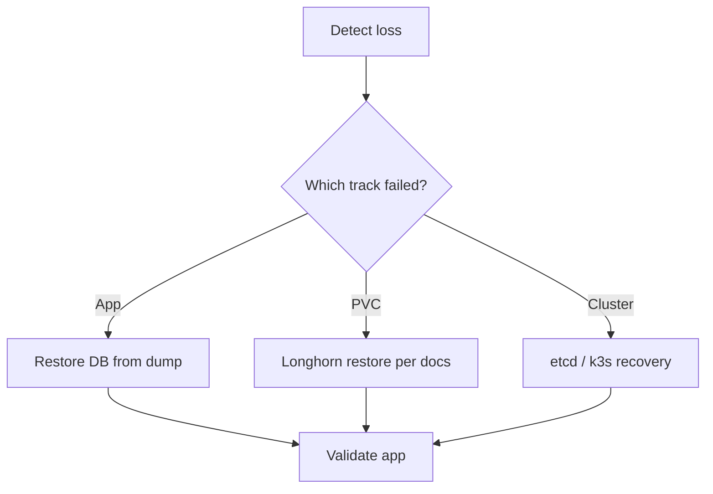

# Raspberry Pi k3s fleet — backup and restore sequence

**Parent runbook**: [`How to provision k3s, Longhorn, and Rancher on a Raspberry Pi fleet`](how-to-provision-k3s-longhorn-and-rancher-on-a-raspberry-pi-fleet.md). **DR package hub**: [`Backup and disaster recovery package — smart farm stack`](backup-and-disaster-recovery-package-smart-farm-stack.md). **DR decision rules**: [`Disaster recovery decision rules — farm edge stack`](disaster-recovery-decision-rules-farm-edge-stack.md). **Platform layer**: [`Kubernetes platform backup / DR — Pi, k3s, Longhorn`](kubernetes-platform-backup-dr-pi-k3s-longhorn.md). **Granularity compare**: [`Backup strategy comparison — farmOS, homelab, PostgreSQL, containers`](backup-strategy-comparison-farmos-homelab-postgresql-containers.md).

---

## Three tracks (understand all; implement per phase)

| Track | Protects | P0 | P1 | Later |
|-------|------------|----|----|-------|
| **A. Application logical dumps** | Coherent DB exports (e.g. `pg_dump`) | Optional | Mandatory for farm records | Mandatory |
| **B. Longhorn volume / system backup** | PVC block data + Longhorn metadata | Optional | Recommended | Mandatory with tested restore |
| **C. etcd / k3s state** | Control plane | Rarely needed if cluster is throwaway | Document method | Mandatory with HA story |

**Rule** (from the platform page): track B without track A can still lose application consistency if the database was not quiesced or logically exported.

---

## Mandatory — P1 operator sequence (outline)

1. Choose a backup destination reachable from the cluster (S3-compatible API, NFS on a NAS, restic to external disk, etc.).
2. Implement track A for each stateful application (cron + restic `--stdin-from-command` pattern per the comparison page).
3. Configure Longhorn backup targets and policies per Longhorn docs (see vault captures in source notes) after base volumes work.
4. Document restore order in a tabletop exercise before you need it: PVC restore, namespace recreate, DB import order.
5. Record etcd / k3s snapshot approach matching your install mode (single server vs HA) using [k3s datastore documentation](https://docs.k3s.io/datastore).

---

## Optional (HA / scale)

- Off-site replication of restic repos or versioned object storage.
- Longhorn system backup bundle for storage-layer DR (not a full cluster clone by itself).

---

## Restore drill flow (reference)

---

## Pi / off-grid notes

- Schedule heavy backup jobs when power margin exists — [`Off-grid implications — backup and networking choices`](off-grid-implications-backup-and-networking-choices.md).
- When using restic with database dumps, follow upstream guidance so dump failures are not masked (see [`Backup strategy comparison`](backup-strategy-comparison-farmos-homelab-postgresql-containers.md)).

---

## Related

- [`Restore and recovery tiers — homelab farm systems`](restore-recovery-tiers-homelab-farm-systems.md)
- [`Validation checklist`](raspberry-pi-k3s-fleet-validation-checklist.md)
