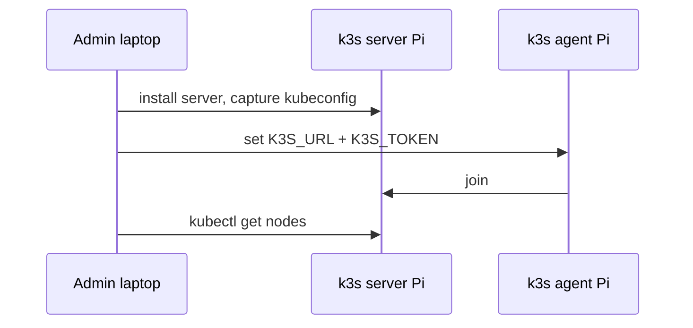

# Raspberry Pi k3s fleet — bootstrap sequence

**Parent runbook**: [`How to provision k3s, Longhorn, and Rancher on a Raspberry Pi fleet`](how-to-provision-k3s-longhorn-and-rancher-on-a-raspberry-pi-fleet.md). **Sources**: [`k3s quick-start capture`](../../raw/processed/2026/k3s-quick-start-guide-docs-capture-inbox-2026-04-18.md).

---

## Mandatory — first control plane (P0/P1)

Do not paste cluster tokens into chat logs or tickets; treat them like passwords.

1. Prepare the first server node: hostname, time sync, OS updates per policy, disk layout documented.
2. Install k3s server per current upstream install instructions (curl script or package—follow org policy).
3. Record securely: node token (or equivalent) for agent joins; API URL agents will use in `K3S_URL` (typically `https://<server-ip>:6443`).
4. Copy admin kubeconfig from the server to your admin machine with file mode `0600`.
5. Verify: `kubectl get nodes` shows the server as `Ready`.

---

## Mandatory — join agents

1. On each agent Pi, install the k3s agent per docs.
2. Export `K3S_URL` and `K3S_TOKEN` (or use the config mechanism from docs) before starting the agent service.
3. If the hostname collides, set `K3S_NODE_NAME` explicitly.
4. Verify each agent is `Ready` in `kubectl get nodes`.

---

## Optional (HA / scale) — additional servers

Do this later, only after the single-server path is boring:

1. Read [k3s HA embedded etcd](https://docs.k3s.io/datastore/ha-embedded) end-to-end.
2. Join additional servers with documented `--cluster-init` / HA join flags—do not improvise flag combinations.
3. Run a failure drill: power down one server, confirm the API stays up, restore power.

---

## Sequence diagram (conceptual)

---

## Pi-specific cautions

- SD-card rootfs: prefer USB SSD for the server running etcd; watch `kubectl get events` for disk latency.
- Do not run heavy workloads before completing [`Longhorn storage configuration sequence`](raspberry-pi-k3s-fleet-longhorn-storage-configuration-sequence.md) if PVCs are in scope.

---

## Related

- [`Validation checklist`](raspberry-pi-k3s-fleet-validation-checklist.md)
- [`Troubleshooting and degraded modes`](raspberry-pi-k3s-fleet-troubleshooting-and-degraded-modes.md)
