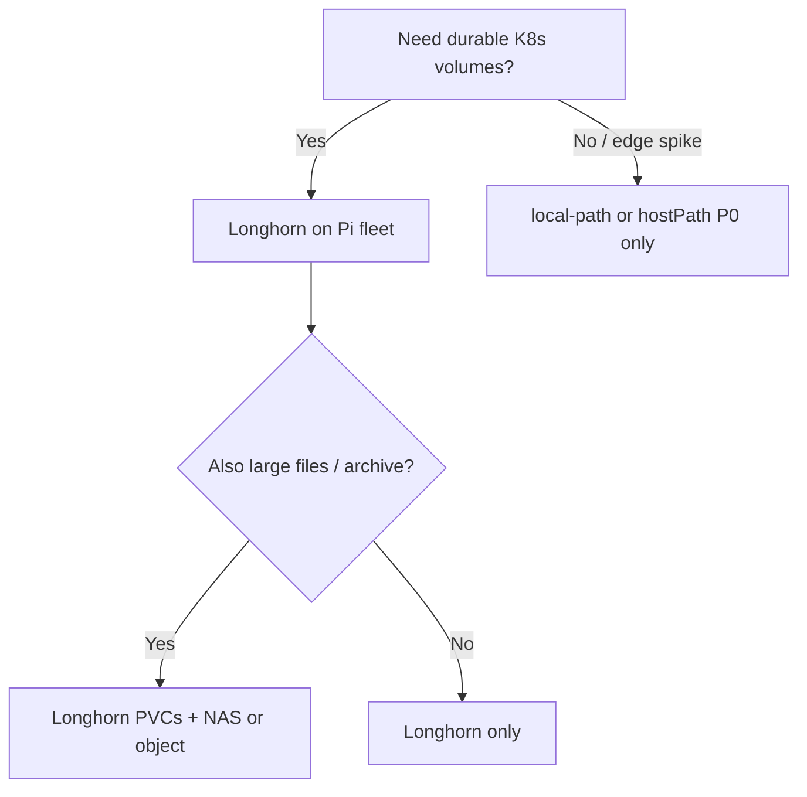

# Raspberry Pi k3s fleet — central and HA storage options

**Parent runbook**: [`How to provision k3s, Longhorn, and Rancher on a Raspberry Pi fleet`](how-to-provision-k3s-longhorn-and-rancher-on-a-raspberry-pi-fleet.md). **Conceptual compare**: [`Longhorn vs central storage architecture`](longhorn-vs-central-storage-architecture-homelab-farm-platform.md).

---

## Decision outline

---

## Option A — Longhorn distributed across nodes (common)

**Mandatory** for this path (see [`Longhorn storage configuration sequence`](raspberry-pi-k3s-fleet-longhorn-storage-configuration-sequence.md)):

- Dedicated disk per replica node you rely on.
- open-iscsi on each schedulable Longhorn node.
- Replica count matched to reality: three replicas need three healthy disks on three nodes—not “free” on Pis.

**P0/P1**: Two or even one replica for non-critical PVCs may be acceptable if backups exist—document RPO honestly.

**Optional (HA / scale)**:

- Longhorn backup target to S3-compatible storage or NFS on a central server.
- Node or disk tags to keep replicas off the etcd Pi if you want control-plane separation (validate against current Longhorn docs).

---

## Option B — Central NAS / NFS (or SMB) for specific workloads

**Use for**: large media, read-mostly archives, backup landing zones.

**Mandatory**:

- Network path stable enough for your app’s latency and loss budget.
- Avoid starving the etcd disk with synchronous NFS-heavy traffic on the same Pi without measurement.

**Optional (HA / scale)**: dual NAS heads or off-site rsync—later.

---

## Option C — Multiple storage servers (hybrid)

**Pattern**: Two or more Pis (or small x86 hosts) with good disks as Longhorn nodes, plus a NAS used only as a backup target.

**P1-friendly**: Keeps Kubernetes PVCs in Longhorn while offloading bulk files to central storage.

---

## k3s control-plane HA (storage-adjacent)

| Pattern | Phase | Notes |
|---------|-------|--------|
| Single embedded etcd server | P0/P1 | Simplest; backup cluster state per k3s docs and your install method. |
| Three or more HA servers | Later | Follow [k3s HA embedded etcd](https://docs.k3s.io/datastore/ha-embedded) exactly—test failure in staging first. |

**Rule**: Storage HA (Longhorn replicas) does not replace control-plane HA or off-site backups.

---

## Related

- [`Kubernetes platform backup / DR`](kubernetes-platform-backup-dr-pi-k3s-longhorn.md)
- [`Bootstrap sequence`](raspberry-pi-k3s-fleet-bootstrap-sequence.md)
