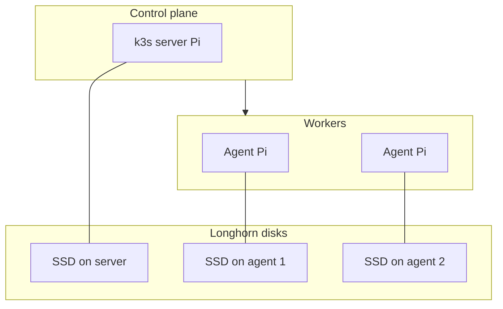

# Raspberry Pi k3s fleet — hardware BOM and node roles

**Parent runbook**: [`How to provision k3s, Longhorn, and Rancher on a Raspberry Pi fleet`](how-to-provision-k3s-longhorn-and-rancher-on-a-raspberry-pi-fleet.md).

---

## Node roles (k3s vocabulary)

| Role | k3s mode | Typical Pi duty |
|------|----------|-----------------|
| Server (control plane) | `k3s server` | API, scheduler, embedded etcd—highest stability bar. |
| Agent | `k3s agent` | Workloads; join with `K3S_URL` + `K3S_TOKEN`. |

**Mandatory** for any multi-node fleet: one first server (or an HA set later); zero or more agents.

---

## Bill of materials (minimum sane)

### Mandatory (P0/P1)

| Item | Notes |
|------|--------|
| One Pi as first k3s server | Prefer USB3 SSD or NVMe for etcd; SD-only server is a known fragility pattern. |
| Additional Pis as agents | Optional in P0; common in P1. Adequate cooling—throttling hurts Longhorn and etcd. |
| Dedicated disk per Longhorn node you care about | Assign block devices or partitions deliberately—not “whatever was left on the SD card” without a plan. |
| open-iscsi on storage nodes | Longhorn uses an iSCSI client on each replica host—see [`Longhorn storage configuration sequence`](raspberry-pi-k3s-fleet-longhorn-storage-configuration-sequence.md). |
| Switch + cabling | Gigabit Ethernet assumed; avoid flaky USB Ethernet for control-plane nodes. |

### Optional (HA / scale) — later

| Item | Why |
|------|-----|
| Two or more k3s servers | Control-plane HA—not a P0 default. |
| UPS | Brownouts correlate with etcd pain; see [`Network and power prerequisites`](raspberry-pi-k3s-fleet-network-and-power-prerequisites.md). |
| Storage-heavy nodes | Concentrate replicas on Pis with the best disks and cooling. |

---

## Role diagram

**Optional (HA / scale)**: add k3s servers per upstream HA bootstrap—see [`Central and HA storage options`](raspberry-pi-k3s-fleet-central-and-ha-storage-options.md).

---

## Anti-patterns (Pi reality)

- Running Rancher, Longhorn, a heavy database, and full observability on one 4 GB Pi: expect OOM; split roles or defer Rancher ([`Rancher installation sequence`](raspberry-pi-k3s-fleet-rancher-installation-sequence.md)).
- Expecting SD-card IOPS to replace a backup strategy: not acceptable for P1.

---

## Related

- [`Prerequisites and assumptions`](raspberry-pi-k3s-fleet-prerequisites-and-assumptions.md)
- [`Bootstrap sequence`](raspberry-pi-k3s-fleet-bootstrap-sequence.md)
