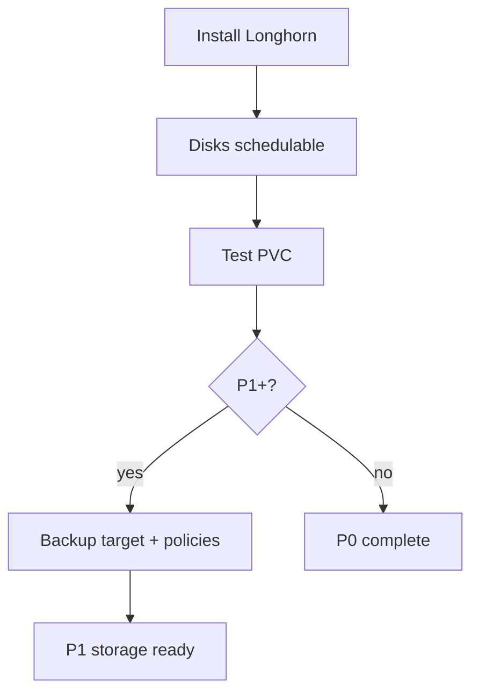

# Raspberry Pi k3s fleet — Longhorn storage configuration sequence

**Parent runbook**: [`How to provision k3s, Longhorn, and Rancher on a Raspberry Pi fleet`](how-to-provision-k3s-longhorn-and-rancher-on-a-raspberry-pi-fleet.md). **Capture**: [`Longhorn CSI on K3s`](../../raw/processed/2026/longhorn-csi-on-k3s-docs-capture-inbox-2026-04-18.md).

---

## Preconditions (mandatory)

- Working k3s cluster with all nodes `Ready` ([`Bootstrap sequence`](raspberry-pi-k3s-fleet-bootstrap-sequence.md)).
- `open-iscsi` and `iscsiadm` on every node that will host Longhorn replicas or components required by the docs.
- Disks prepared per your layout (raw device, partition, or LVM LV)—follow current Longhorn documentation for disk selection and tags.

---

## Mandatory — operator sequence (outline)

Exact commands change by Longhorn version—use the upstream install guide (Helm or manifest) you select.

1. Install Longhorn manager, engine, and CSI driver per Longhorn-on-K3s instructions; confirm CRDs exist (`kubectl get crd | grep longhorn`).
2. Confirm nodes and disks appear schedulable in the Longhorn UI or via `kubectl`; fix unschedulable reasons before production PVCs.
3. Decide default StorageClass policy deliberately:
   - **P0**: Often acceptable to leave Longhorn non-default until replica cost is understood.
   - **P1+**: Mark default only after accepting replica CPU and IO overhead on Pis.
4. Create a test PVC and Pod that write and read data; delete and recreate to validate binding.

---

## Mandatory — resource realism on Raspberry Pi

| Knob | Guidance |
|------|-----------|
| Replica count | Three replicas means write amplification and CPU load on small ARM cores—prefer fewer replicas for non-critical PVCs in P1. |
| Over-provisioning | Disable or tighten if you see OOM during volume rebuilds. |
| Replicas on server node | Some operators taint or exclude the etcd node from storage—validate against your HA plan ([`Hardware BOM`](raspberry-pi-k3s-fleet-hardware-bom-and-node-roles.md)). |

---

## Optional (HA / scale)

- Backup target to S3-compatible or NFS storage—only after base volumes work ([`Backup and restore sequence`](raspberry-pi-k3s-fleet-backup-and-restore-sequence.md)).
- Recurring snapshot/backup jobs: watch CPU during scheduled hours; prefer stable utility power on off-grid sites.

---

## Health flow (reference)

---

## Related

- [`Central and HA storage options`](raspberry-pi-k3s-fleet-central-and-ha-storage-options.md)
- [`Kubernetes platform backup / DR`](kubernetes-platform-backup-dr-pi-k3s-longhorn.md)
