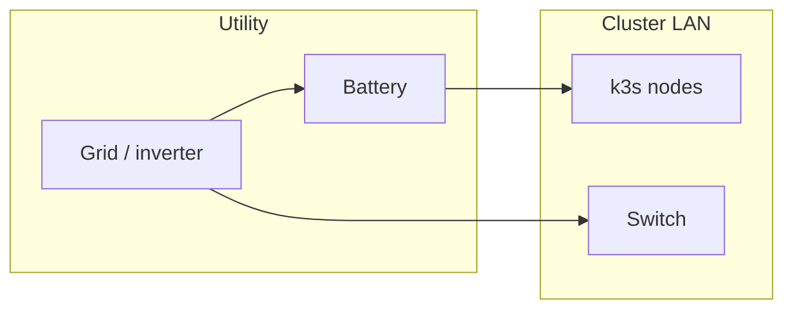

# Raspberry Pi k3s fleet — network and power prerequisites

**Parent runbook**: [`How to provision k3s, Longhorn, and Rancher on a Raspberry Pi fleet`](how-to-provision-k3s-longhorn-and-rancher-on-a-raspberry-pi-fleet.md).

---

## Network — mandatory

1. Stable L2/L3 connectivity between all cluster nodes (same site for P0/P1 unless you are explicitly building multi-site later).
2. Reserved IPs or DHCP reservations; document hostname or IP used in `K3S_URL`.
3. DNS or `/etc/hosts` consistency for TLS names (Rancher, ingress, Longhorn UI if exposed).
4. Firewall rules documented per [k3s networking requirements](https://docs.k3s.io/installation/requirements#networking) at install time.
5. Time sync available (internet NTP or local stratum server).

### Optional (HA / scale)

- Secondary uplink or out-of-band way to power-cycle remote Pis (no IPMI on Pi—plan smart PDU or on-site access).
- Site-to-site VPN only when multi-site etcd or storage replication is explicitly architected (later).

---

## Power — mandatory for P1+

| Requirement | Why |
|---------------|-----|
| Clean shutdown budget | etcd and Longhorn dislike unclean power loss during writes. |
| Known brownout behavior | UPS or generator discipline at farm edge—[`Off-grid power strategy — Demory`](off-grid-power-strategy-demory-farm-site.md). |
| Labeled circuits | Partial cluster power loss produces confusing storage quorum symptoms. |

### Optional (HA / scale)

- UPS feeding switch and core Pis together so the network does not die while nodes stay up.

---

## Farm / off-grid coupling (context)

If optional farm power (`Popt`) cannot sustain cluster plus network baseline load, do not claim a tight P1 RTO: run fewer stateful sets or shut down gracefully before the battery floor. Align with [`Off-grid operational decision rules — power and networking (Demory)`](off-grid-operational-decision-rules-power-and-networking-demory-farm.md) when those constraints apply.

---

## Related

- [`Bootstrap sequence`](raspberry-pi-k3s-fleet-bootstrap-sequence.md)
- [`Troubleshooting and degraded modes`](raspberry-pi-k3s-fleet-troubleshooting-and-degraded-modes.md)
