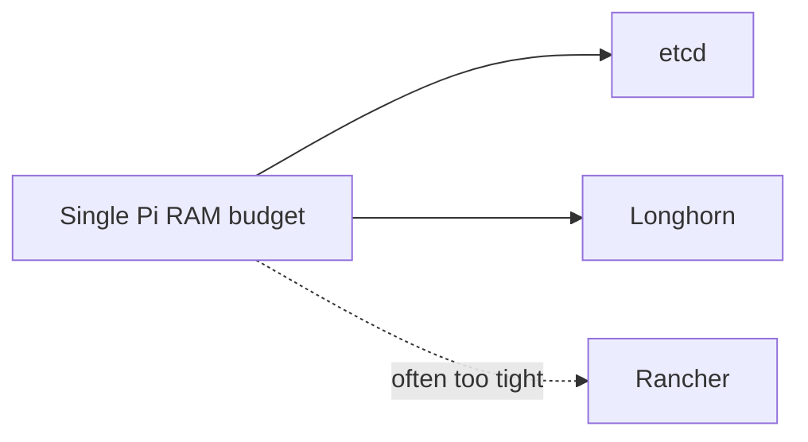

# Raspberry Pi k3s fleet — Rancher installation sequence

**Parent runbook**: [`How to provision k3s, Longhorn, and Rancher on a Raspberry Pi fleet`](how-to-provision-k3s-longhorn-and-rancher-on-a-raspberry-pi-fleet.md). **Strategy**: [`Rancher — role and timing`](rancher-role-and-timing-k3s-homelab-farm-platform.md). **External**: [Install Rancher on Kubernetes](https://rancher.com/docs/rancher/latest/en/installation/install-rancher-on-k8s/) (pin chart version at deploy time).

---

## Phase stance

| Phase | Rancher |
|-------|---------|
| P0 | Skip by default—use `kubectl`, k9s, or similar. |
| P1 | Optional only if k3s, Longhorn, and one stateful app are already stable. |
| Later | Treat Rancher as a critical workload: ingress, TLS, RBAC, upgrades, backups. |

---

## Mandatory — before Helm (whenever you install)

1. Ingress controller plan exists (bundled Traefik vs NGINX vs other) and you know the hostname Rancher will use.
2. TLS strategy chosen: cert-manager + ACME, corporate certs, or lab DNS—not permanent browser click-through for production.
3. Resource headroom: Rancher is not free; do not stack it on a maxed Pi also running etcd and Longhorn without measurement.

---

## Mandatory — installation outline

Follow Rancher docs for Helm repo add, namespace, ingress options, and bootstrap password.

1. Add Helm repo; pick a chart version compatible with your Kubernetes minor.
2. Install into `cattle-system` (or documented namespace) with explicit hostname, replica count (often one on Pi fleets), and ingress class.
3. Complete first-login password rotation and document upgrade procedure.

---

## Optional (HA / scale)

- Multiple Rancher replicas with anti-affinity needs more RAM than a toy Pi budget—validate in staging.
- Downstream cluster registration for other k3s clusters—later concern for multi-site farms.

---

## Resource warning

If this diagram hurts, defer Rancher or move it to stronger hardware.

---

## Related

- [`Validation checklist`](raspberry-pi-k3s-fleet-validation-checklist.md)
- [`Backup and restore sequence`](raspberry-pi-k3s-fleet-backup-and-restore-sequence.md)
