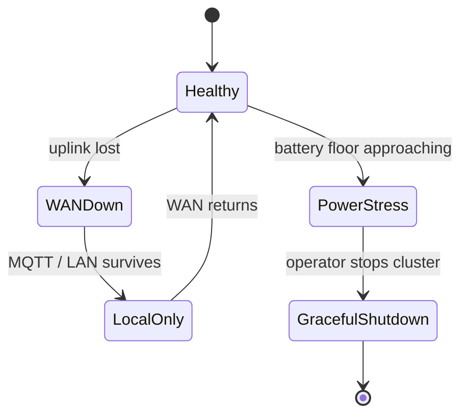

# Raspberry Pi k3s fleet — troubleshooting and degraded modes

**Parent runbook**: [`How to provision k3s, Longhorn, and Rancher on a Raspberry Pi fleet`](how-to-provision-k3s-longhorn-and-rancher-on-a-raspberry-pi-fleet.md).

---

## Symptom → first checks

| Symptom | Check first |
|---------|-------------|
| Node `NotReady` | Network path, time sync, disk full, kubelet logs. |
| Pods `Pending` | CPU/memory requests, taints/tolerations, unbound PVC, CNI health. |
| PVC `Pending` | Longhorn scheduling, disk tags, replica policy vs available nodes. |
| OOMKilled | Reduce replicas; move Rancher or observability off the node; add RAM or split hardware. |
| Slow API / etcd timeouts | SD wear, USB SSD UASP issues, brownout—see [`Network and power prerequisites`](raspberry-pi-k3s-fleet-network-and-power-prerequisites.md). |

---

## Degraded modes (farm-relevant)

| Mode | Safe behavior |
|------|----------------|
| WAN down at edge | Local MQTT or LAN services may continue if power holds—do not assume cloud backups still run. |
| Power stress | Shed non-critical workloads first (Rancher, heavy cron); flush DB dumps before inverter cutout if possible. |
| Storage node lost | Longhorn may degrade—follow Longhorn failure docs; restore from backup if replicas cannot heal. |

**Business context**: [`Manual fallback and degraded modes — critical operations`](manual-fallback-degraded-modes-critical-operations.md), [`Automation stop rules — two-site smart farm`](automation-stop-rules-two-site-smart-farm.md).

---

## Optional (HA / scale) — failure drills

- Power off one agent Pi during idle hours; measure Longhorn rebuild time and CPU.
- Isolate one node from the LAN for 30 minutes; confirm Kubernetes and Longhorn behave as expected before you learn it in production.

---

## When to stop and simplify

If you fight the stack weekly, drop to Compose, a single node, or fewer stateful sets until constraints change ([`Platform decision memo`](platform-decision-memo-phase-homelab-k3s-pi-fleet-2026-04-18.md)).

---

## Related

- [`Network and power prerequisites`](raspberry-pi-k3s-fleet-network-and-power-prerequisites.md)
- [`Validation checklist`](raspberry-pi-k3s-fleet-validation-checklist.md)
