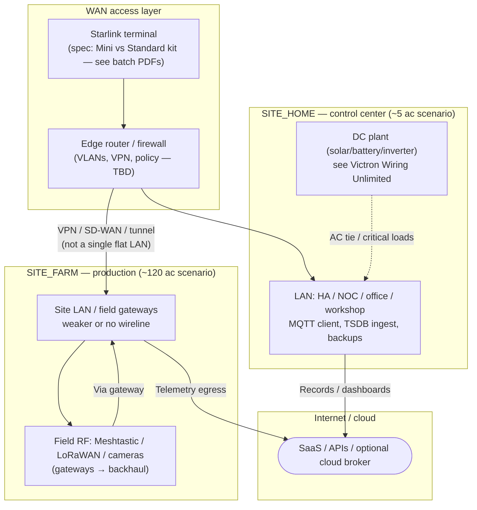
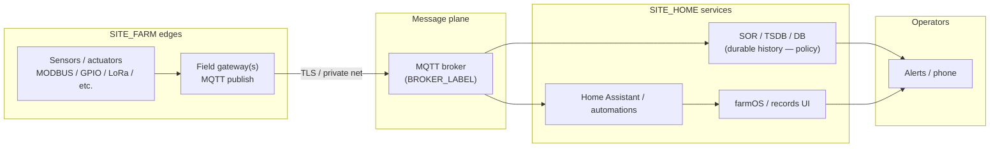
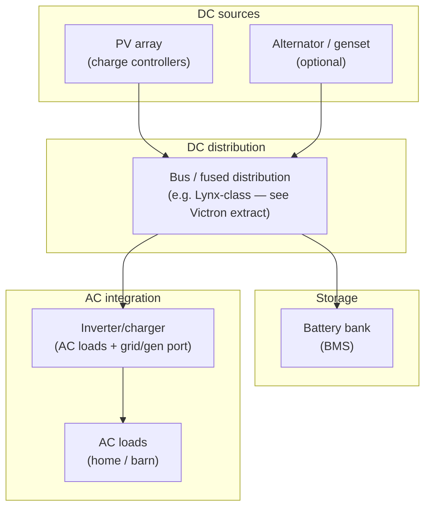
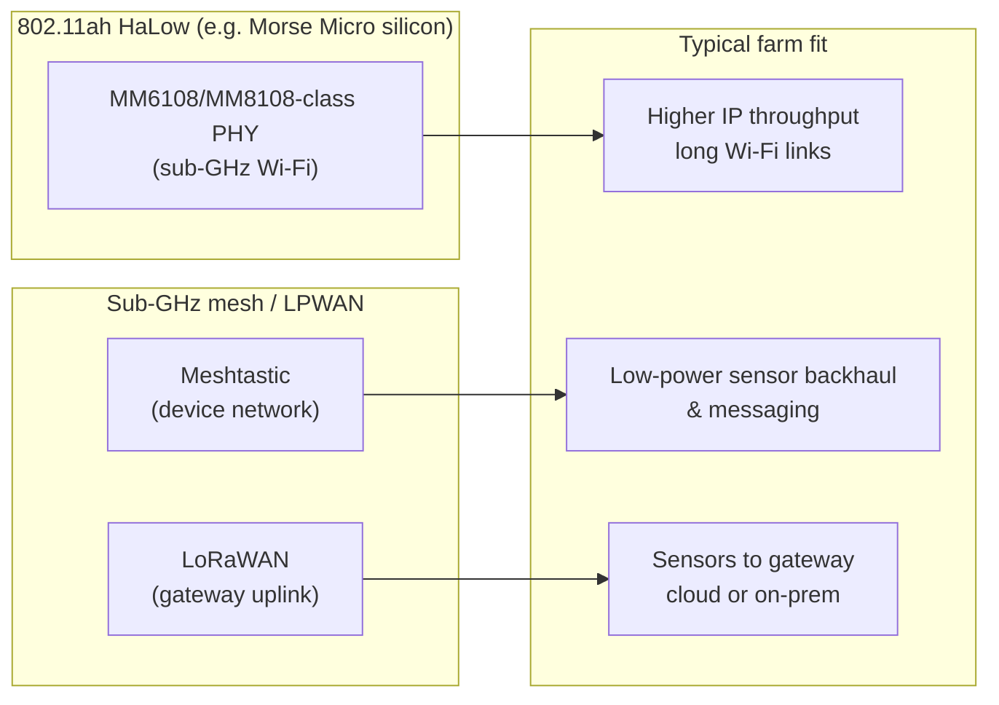

# Two-site smart farm — network topology and WAN/edge reference (Mermaid)

**Purpose**: A **reference-only** view of how **WAN**, **two physical sites**, **field RF**, and **DC electrical context** fit together for the **East Tennessee two-site** scenario. **Not** a deployed design—labels are **logical**. **Diagrams** use **Mermaid** (enabled in [`mkdocs.yml`](../../mkdocs.yml) via `mkdocs-mermaid2-plugin`).

**Provenance batch** (PDFs + captures): [`Electrical, networking, and Starlink — inbox batch (2026-04-23)`](../source-notes/electrical-networking-starlink-inbox-batch-2026-04-23.md). **Canonical stack narrative** (no diagrams): [`Reference architecture — 5-acre home base + 120-acre farm`](reference-architecture-5ac-homebase-120ac-smart-farm.md), [`Field telemetry reference architecture — homestead + 120-acre farm`](field-telemetry-reference-architecture-homestead-120ac.md).

**Reading the sources**

- **Victron *Wiring Unlimited*** — DC busses, Lynx distribution, inverter/charger integration patterns (see PDF extract in batch note).
- **Starlink spec PDFs** — **Mini** vs **Standard / 4× kit** hardware facts for **uplink** planning (not coverage guarantees at your coordinates).
- **Morse Micro MM6108 / MM8108 datasheets** — **Wi‑Fi HaLow** (802.11ah) **RF** positioning for **long-range Wi‑Fi** options at **sub‑GHz**; still **orthogonal** to **Meshtastic/LoRa** in most farm stacks.
- **NREL off-grid solar** modules — **generic** design/O&M framing (Haiti training context); use for **discipline**, not **TN parcel** defaults.
- **Meshtastic captures** — power + getting started for **field mesh** posture.

---

## 1. Places, WAN uplink, and inter-site relationship

**Interpretation**: **Starlink** (or any **satellite/fixed wireless** uplink) is shown as the **shared Internet** path for discussion; **fiber/cable** may exist at **`SITE_HOME`** only—**verify** per address. **`SITE_HOME`** and **`SITE_FARM`** are **not** bridged at L2 across **`COMMUTE_ONE_WAY`**; use **VPN**, **overlay**, or **cloud** for **logical** reunification.

---

## 2. Telemetry and application data plane (logical)

**Interpretation**: Matches the **roles** table on [`Field telemetry reference architecture`](field-telemetry-reference-architecture-homestead-120ac.md)—**transport** (MQTT) is **not** automatically **authority** for compliance records.

---

## 3. DC electrical context (coupled PV/battery/inverter)

**Interpretation**: Abstract pattern from **DC-coupled** training materials—**Victron** book details **Lynx**, **BMS**, **Multi/Quattro** integration. **Your** conductor sizes, fusing, and grounding are **not** stated here.

---

## 4. Optional — long-range Wi‑Fi HaLow vs field mesh (decision overlay)

**Interpretation**: **802.11ah** (HaLow) and **Meshtastic/LoRa** solve **different** problems—throughput vs **very low-rate** telemetry; **coexistence** is **planning**, not **one radio**.

---

## Limits

- **No** **public IP**, **VLAN ID**, or **radio channel** choices for **your** sites—those are **deployment** decisions.
- **Starlink** **terms**, **availability**, and **performance** vary—treat PDFs as **hardware** references.
- **Mermaid** renders on the **MkDocs** site; **Obsidian** may need a Mermaid plugin for the same diagrams in vault view.

---

## Related

- [`Electrical, networking, and Starlink — inbox batch (2026-04-23)`](../source-notes/electrical-networking-starlink-inbox-batch-2026-04-23.md)
- [`Two-site smart farm operations`](../topics/two-site-smart-farm-operations.md)
- [`Remote access and operational security model — two-site smart farm`](remote-access-operational-security-model-two-site-smart-farm.md)
