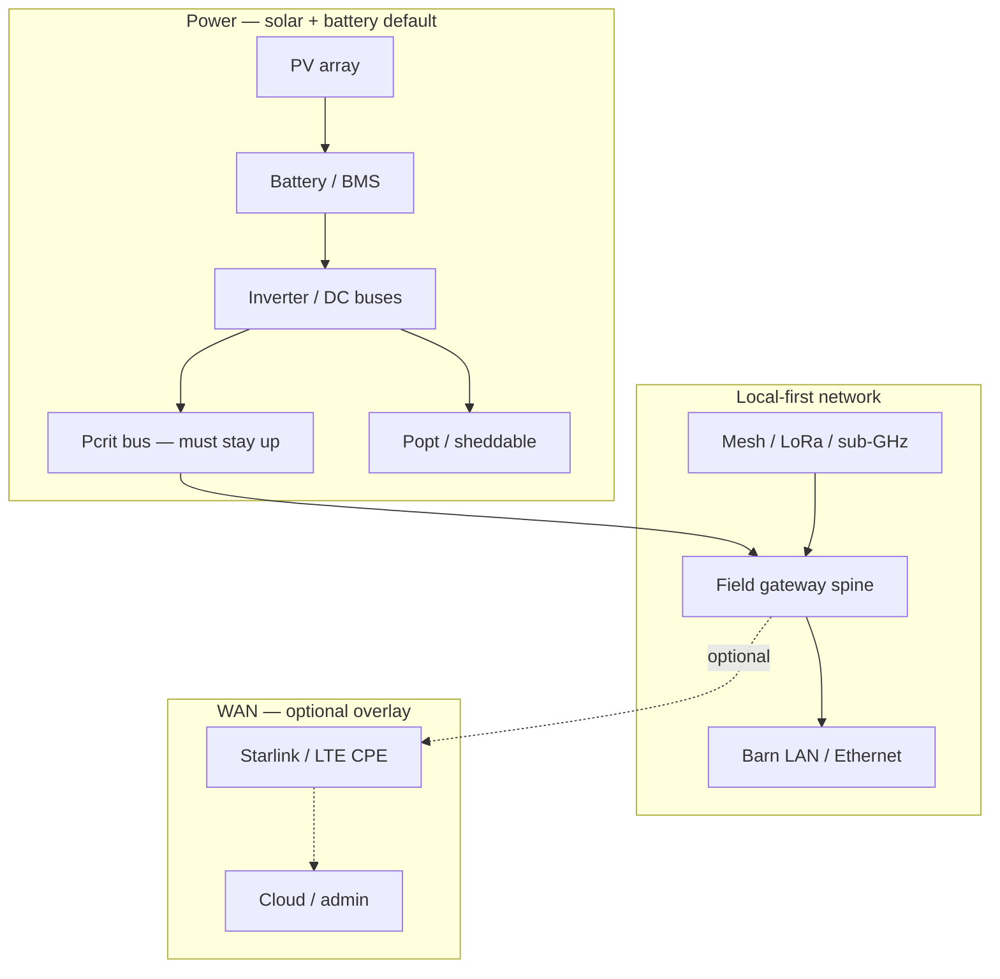

# Off-grid systems doctrine package — Demory farm site (`SITE_FARM`)

**Purpose**: **First-class** **doctrine** for **`SITE_FARM`** at **[Demory](../entities/demory-farm-site.md)** (**Campbell County**): **off-grid-first** **electrical** architecture (**solar + batteries** **default**), **resilient local** **networking** (**mesh** **/** **sub-GHz** **where justified**), **WAN** **as** **optional** **overlay**, explicit **degraded** **modes**, **field-node** **classes**, and **stop** **rules** **—** **without** **inventing** **kW** **/** **Ah** **/** **SKU** **choices** **(**those** **are** **local** **engineering** **after** **measured** **loads** **).**

**Business plan spine**: [`East Tennessee two-site farm business plan (package)`](../business-plan/east-tennessee-two-site-farm-business-plan.md) · [`Execution dossier — Phase 0–1`](../analyses/execution-dossier-hub-phase-0-1-east-tennessee.md) · [`First 90 days`](../analyses/execution-first-90-days-phase-0-1-east-tennessee.md) (**Demory** **parallel** **rules**).

**Provenance hub**: [`Off-grid power, field RF, and optional WAN — source index`](../source-notes/off-grid-power-rf-wan-source-index-demory-planning-2026-04.md).

**Umbrella router** (off-grid + field RF + two-site WAN—without replacing this page): [`Off-grid power and field networking hub`](off-grid-power-and-field-networking-hub.md).

---

## What this hub owns

- **Full doctrine** for **off-grid-first `SITE_FARM` at Demory**: power domains, **G/R/S/H/W** node classes, WAN as overlay, degraded modes, **DR-*** stop rules.
- **Diagrams** and **read order** for **Demory-specific** analyses below.

## Start here

| Goal | Page |
|------|------|
| **Read the doctrine in order** | Follow **Doctrine map** (next section)—row **1** is [`Off-grid power doctrine — Demory`](../analyses/off-grid-power-strategy-demory-farm-site.md) |
| **Two-site WAN** (both sites, not only Demory) | [`Connectivity strategy — Claxton & Demory`](../analyses/connectivity-strategy-for-claxton-and-demory.md) via [`Off-grid power and field networking hub`](off-grid-power-and-field-networking-hub.md) |

## Canonical vs supporting

| **Canonical** (this package) | **Supporting** |
|----------------------------|----------------|
| Rows **1–7** in **Doctrine map** | Comparisons, Mermaid-only pages, [`Loads register`](../analyses/loads-register-known-estimated-unknown-two-sites-east-tennessee.md) (placeholders) |

---

## Doctrine map (read order)

| # | Page | Role |
|---|------|------|
| 1 | [`Off-grid power doctrine — Demory farm site`](../analyses/off-grid-power-strategy-demory-farm-site.md) | **Policy**: off-grid-first stance; always-on vs duty-cycled; networking as load |
| 2 | [`Power domains and battery-backed infrastructure tiers — Demory`](../analyses/off-grid-power-domains-and-battery-tiers-demory-farm.md) | **Pcrit** **/** **Popt** **;** **tiers** **tied** **to** **network** **spine** |
| 3 | [`Field-node classes and communication roles — Demory`](../analyses/field-node-classes-and-communication-roles-demory-farm.md) · **Entity** [`Field node classes (G/R/S/H/W)`](../entities/field-node-classes-off-grid-farm-roles.md) | **RF** **/** **gateway** **/** **sensor** **roles** **(**not** **a** **shopping** **list** **)** |
| 4 | [`Connectivity dependency map — farm systems (Demory)`](../analyses/connectivity-dependency-map-farm-systems-demory-farm.md) | **What** **requires** **WAN** **vs** **what** **must** **not** |
| 5 | [`Local-first / WAN-optional operating model — Demory`](../analyses/local-first-wan-optional-operating-model-demory-farm.md) | **Operating** **posture** **;** **pilot** **vs** **scale** |
| 6 | [`Off-grid degraded modes — power and connectivity`](../analyses/off-grid-degraded-modes-power-and-connectivity-demory-farm.md) | **P1** **/** **P2** **/** **N1** **/** **N2** **failure** **classes** |
| 7 | [`Off-grid infrastructure stop rules — Demory`](../analyses/off-grid-operational-decision-rules-power-and-networking-demory-farm.md) | **DR-*** **rules** **;** **simplification** **triggers** **;** **links** **CS-5** **/** **MV-8** |

**Diagrams**: [`Off-grid farm execution topology — Demory (Mermaid)`](../analyses/off-grid-farm-execution-topology-demory-mermaid.md) · [`Mesh and field networking — off-grid Demory`](../analyses/mesh-and-field-networking-strategy-off-grid-demory-farm.md) · [`Connectivity strategy — Claxton & Demory`](../analyses/connectivity-strategy-for-claxton-and-demory.md).

**Loads register** (site-specific placeholders): [`Loads register — two sites`](../analyses/loads-register-known-estimated-unknown-two-sites-east-tennessee.md).

---

## End-to-end doctrine (Mermaid)

**Reading**: **Solid** lines are **required** **for** **local** **operations** **;** **dotted** **WAN** **path** **is** **discretionary** **Wh** **and** **ops** **.**

---

## Non-negotiables (summary)

| Must work **without WAN** | May use WAN when powered and policy allows |
|---------------------------|---------------------------------------------|
| Welfare-related **local** interlocks (water, gates policy) | Remote dashboards, OTA (if chosen), weather |
| **At least one** local path to **verify** critical state (sight, float, local UI) | **Starlink** for coordination—not for **sole** welfare proof |
| **Paper** / offline record discipline for books | Cloud **egress** of MQTT |

---

## Related

- [`Off-grid power and field networking hub`](off-grid-power-and-field-networking-hub.md) — cross-site router
- [`Demory farm — site intelligence`](../analyses/demory-farm-site-intelligence.md)
- [`Automation stop rules — two-site smart farm`](../analyses/automation-stop-rules-two-site-smart-farm.md) (**CS-5**, **MV-8**)
- [`Manual fallback and degraded modes — critical operations`](../analyses/manual-fallback-degraded-modes-critical-operations.md)
