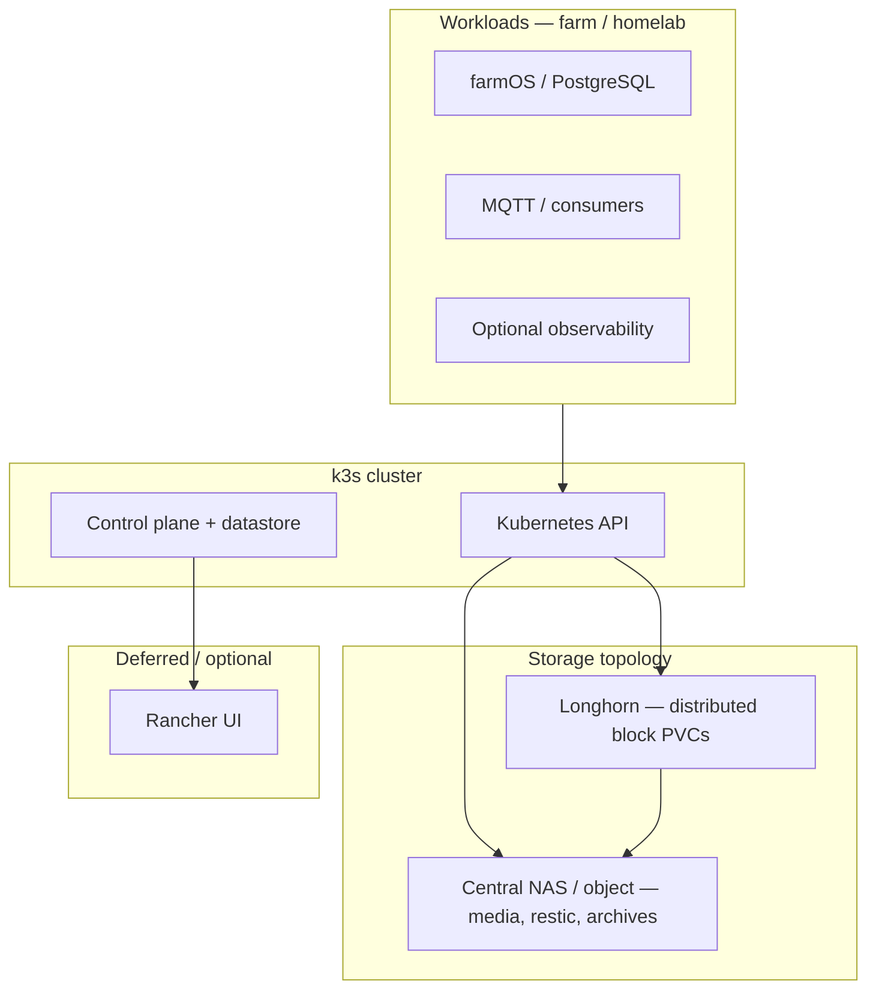

# Platform doctrine package — homelab / farm edge compute

**Purpose**: **First-class** **doctrine** for the wiki’s **homelab / farm edge** compute layer: what the stack is **for**, what belongs in **early phases**, what is **deferred**, and what **high availability** means **here** (not generic Kubernetes marketing). **Operator posture**: prefer **official** k3s / Longhorn / Rancher docs and this repo’s **captures**; **pilot-ready** and **production-ready** are **explicitly** different bars.

**Non-goals**: Mandating Kubernetes for every workload; **multi-cluster** or **service mesh** as defaults; **geographic** HA without a separate DR story.

---

## What this hub owns

- **Doctrine** for **Pi / k3s / Longhorn / Rancher** on the **farm edge** and **homelab**: phases, **HA** meaning, storage topology, and **deferrals**.
- **Pointers** to **provisioning** and **backup** tracks—**not** duplicate [`Backup and disaster recovery — doctrine hub`](backup-disaster-recovery-doctrine-hub.md) or raw **kubectl** recipes outside the linked runbook.

## Start here

| Goal | Page |
|------|------|
| **Why this stack** | [`Platform strategy for farm and homestead services`](../analyses/homelab-edge-kubernetes-platform-strategy-pi-k3s-longhorn-rancher.md) |
| **What is approved vs deferred** | [`Platform decision memo — phase, HA scope, deferrals`](../analyses/platform-decision-memo-phase-homelab-k3s-pi-fleet-2026-04-18.md) |
| **Hands-on sequence** | [`How to provision k3s, Longhorn, and Rancher on a Raspberry Pi fleet`](../analyses/how-to-provision-k3s-longhorn-and-rancher-on-a-raspberry-pi-fleet.md) |

## Canonical vs supporting

| **Canonical** (durable navigation) | **Supporting** (depth, alternatives) |
|-----------------------------------|----------------------------------------|
| [`Platform strategy…`](../analyses/homelab-edge-kubernetes-platform-strategy-pi-k3s-longhorn-rancher.md), [`Platform decision memo…`](../analyses/platform-decision-memo-phase-homelab-k3s-pi-fleet-2026-04-18.md), [`HA meaning and constraints…`](../analyses/ha-meaning-and-constraints-homelab-farm-platform.md), component **role** pages (k3s, Longhorn, Rancher) | [`Raspberry Pi fleet provisioning standard`](../analyses/raspberry-pi-fleet-provisioning-standard-smart-farm-homelab.md), RKE2 narrative captures, [`Docker, Kubernetes, Compose, and Bake`](docker-kubernetes-compose-and-bake.md) |

---

## What this platform is for

| Need | How the stack serves it |
|------|-------------------------|
| **farmOS + PostgreSQL** (records, geometry) | Stateful workloads on **k3s** with **PVCs** (Longhorn or external storage); logical **DB dumps** still required ([`Backup strategy comparison`](../analyses/backup-strategy-comparison-farmos-homelab-postgresql-containers.md)). |
| **Telemetry** (broker, consumers, optional TSDB) | Burstable **edge** services on the same cluster or a **lighter** compose stack—**doctrine** allows **either** if ops burden matches team size ([`Field telemetry ref arch`](../analyses/field-telemetry-reference-architecture-homestead-120ac.md)). |
| **Backup / DR** | **etcd**, **Longhorn volumes**, **app-level** backups are **different** tracks ([`Kubernetes platform backup / DR`](../analyses/kubernetes-platform-backup-dr-pi-k3s-longhorn.md), [`DR package`](../analyses/backup-and-disaster-recovery-package-smart-farm-stack.md)). |
| **Homestead vs farm site** | **Control plane** may live at **`SITE_HOME`**; **edge** nodes at **`SITE_FARM`** must respect **power** and **WAN** reality ([`Two-site operations`](../topics/two-site-smart-farm-operations.md)). |

**Entity anchors** (durable roles, not hostnames): [`Edge cluster storage roles — homelab / farm stack`](../entities/edge-cluster-storage-roles-homelab-farm.md), [`Kubernetes edge control-plane roles`](../entities/kubernetes-edge-control-plane-roles.md), [`Backup and restore tier labels — farm stack`](../entities/backup-restore-tier-labels-farm-stack.md), [`Edge service deployment classes — pilot vs production`](../entities/edge-service-deployment-classes.md).

---

## Doctrine map (read order)

| # | Page | Role |
|---|------|------|
| 1 | [`Platform strategy for farm and homestead services`](../analyses/homelab-edge-kubernetes-platform-strategy-pi-k3s-longhorn-rancher.md) | **Why** this stack; principles; layered view |
| 2 | [`Platform decision memo — phase, HA scope, deferrals`](../analyses/platform-decision-memo-phase-homelab-k3s-pi-fleet-2026-04-18.md) | **Approved now vs later**; anti-patterns |
| 3 | [`HA meaning and constraints — homelab / farm platform`](../analyses/ha-meaning-and-constraints-homelab-farm-platform.md) | What **HA** **does / does not** mean here |
| 4 | [`k3s role in the homelab / farm platform`](../analyses/k3s-role-in-homelab-farm-platform.md) | Control plane, datastore, boundaries |
| 5 | [`Longhorn role in the homelab / farm platform`](../analyses/longhorn-role-in-homelab-farm-platform.md) | CSI, replication scope, ops cost |
| 6 | [`Rancher — role and timing`](../analyses/rancher-role-and-timing-k3s-homelab-farm-platform.md) | Optional UX; when **not** to install |
| 7 | [`Central vs distributed storage architecture`](../analyses/longhorn-vs-central-storage-architecture-homelab-farm-platform.md) | Longhorn vs NAS/object; hybrid |
| 8 | [`Raspberry Pi fleet provisioning standard`](../analyses/raspberry-pi-fleet-provisioning-standard-smart-farm-homelab.md) | Per-node checklist; pilot vs production |

**Runbook (how)**: [`How to provision k3s, Longhorn, and Rancher on a Raspberry Pi fleet`](../analyses/how-to-provision-k3s-longhorn-and-rancher-on-a-raspberry-pi-fleet.md) — sequences from bootstrap through validation.

**Provenance**: [`K3s / Longhorn / Rancher / Pi platform captures`](../source-notes/k3s-longhorn-rancher-pi-platform-official-captures-inbox-2026-04-18.md).

---

## Reference architecture (doctrine layer)

**Legend**: **Longhorn** and **central** storage are **often both** present in a **hybrid** pattern; **Rancher** is optional and **not** required for a valid cluster.

---

## Pilot-ready vs production-ready (summary)

| Bar | Pilot-ready (Phase 0/1) | Production-ready |
|-----|-------------------------|------------------|
| **Control plane** | Single k3s server + embedded datastore acceptable for lab | HA servers + **tested** restore ([`HA doctrine`](../analyses/ha-meaning-and-constraints-homelab-farm-platform.md)) |
| **Data** | One stateful app proven; backups **manual** but **restored once** | **Scheduled** backups, monitored disks, patch cadence |
| **Rancher** | Usually **deferred** | Only if **RBAC** + **ingress** + **upgrade** process owned |

---

## Related hubs

- [`Procedural guides package strategy — Smart Farm Wiki`](procedural-guides-package-strategy-smart-farm-wiki.md) — how-tos and runbooks: where they live, **vs** standards, **`operational_maturity`**
- [`Operational standards — farm and homelab platform`](operational-standards-farm-homelab-platform.md) — Pi, k3s, storage, secrets, field naming, site boundaries
- [`Backup and disaster recovery — doctrine hub`](backup-disaster-recovery-doctrine-hub.md) — etcd / PVC / DB tracks
- [`Off-grid power and field networking hub`](off-grid-power-and-field-networking-hub.md) — power/WAN reality at **`SITE_FARM`**
- [`Wiki navigation and structural hubs`](wiki-navigation-and-structural-hubs.md) — router entry
- [`Docker, Kubernetes, Compose, and Bake`](docker-kubernetes-compose-and-bake.md) — when **not** to use k3s
- [`Reference architecture — 5 ac + 120 ac`](../analyses/reference-architecture-5ac-homebase-120ac-smart-farm.md) — smart-farm architecture package
